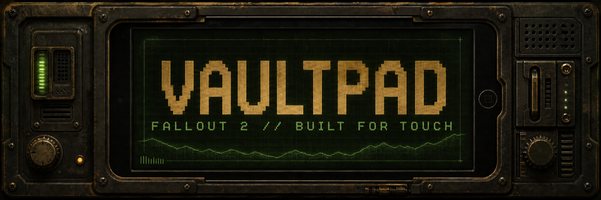
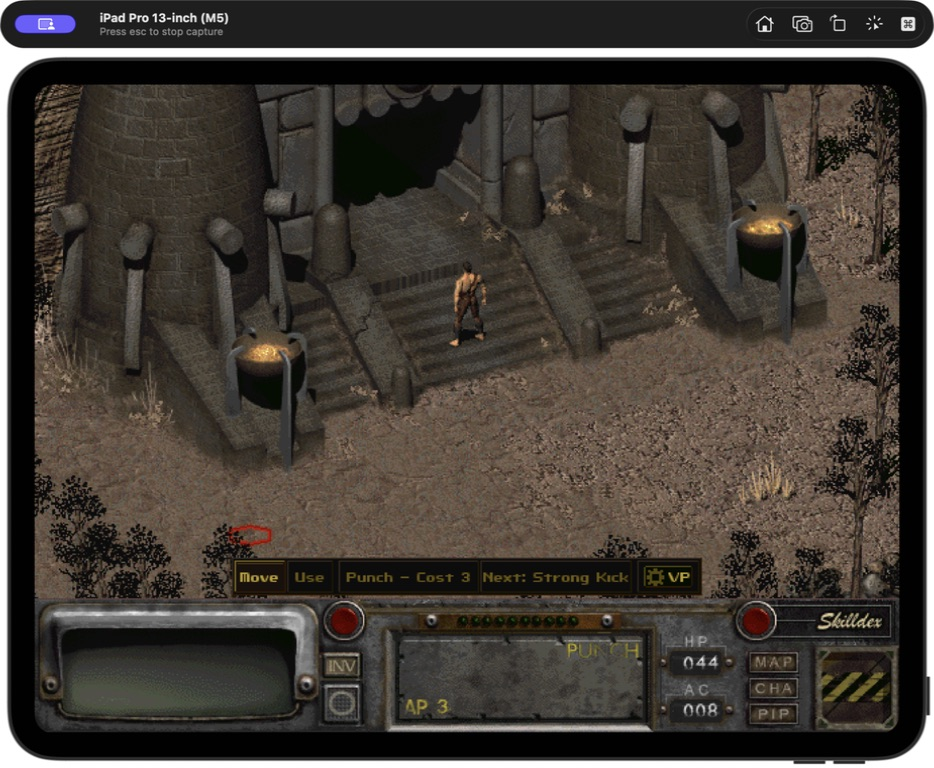
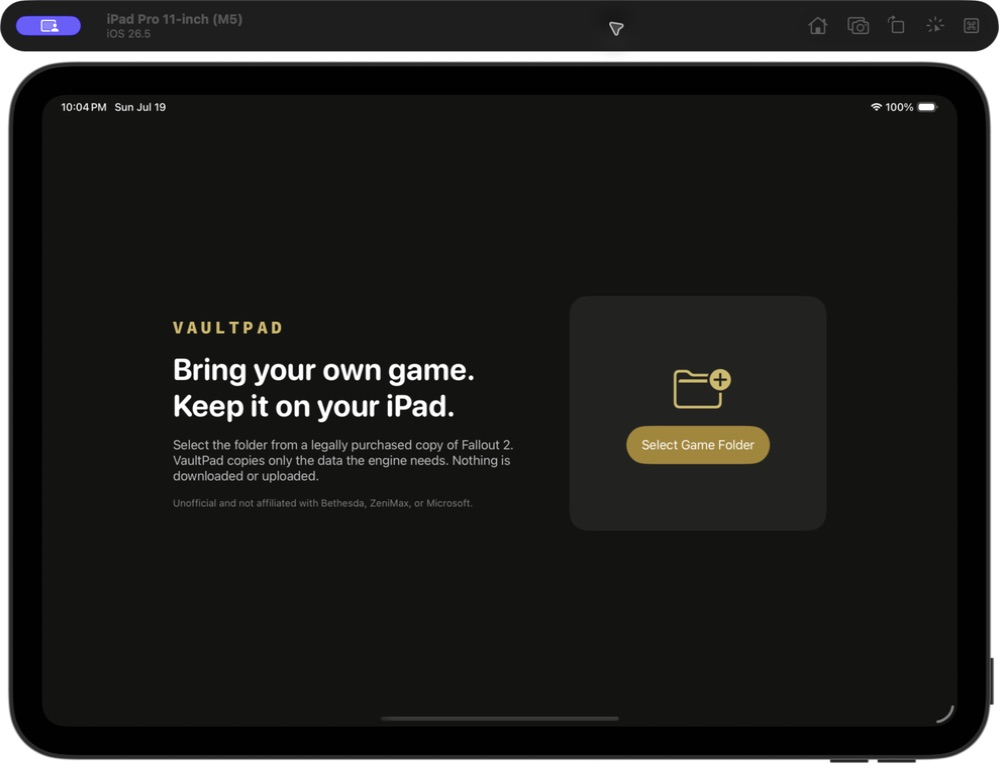
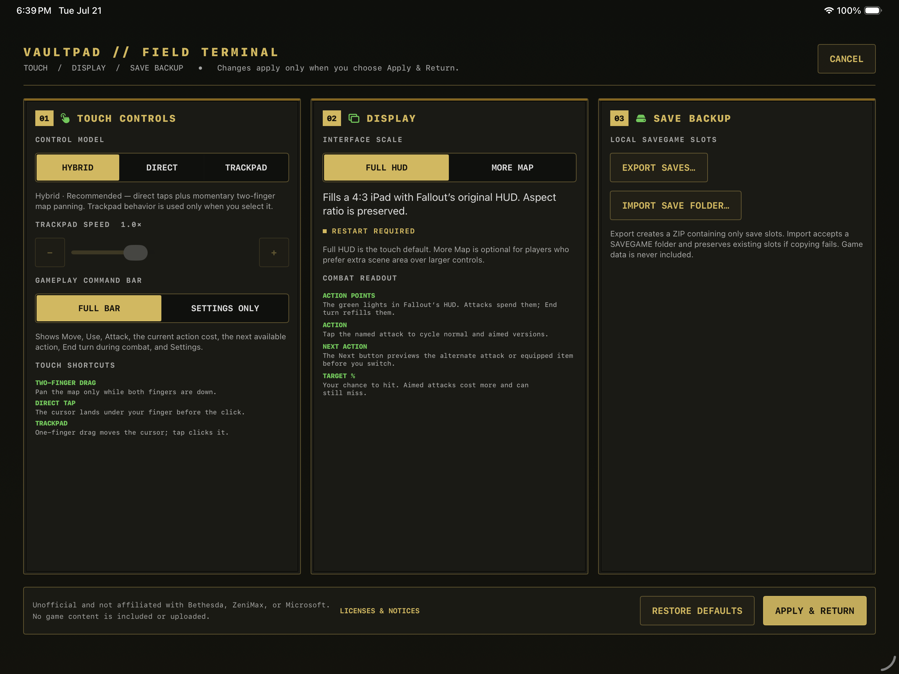

<p align="center">
  
</p>

<p align="center">
  <strong>Fallout 2 on iPad. Touch the world, not a virtual mouse.</strong><br>
  VaultPad pairs Fallout 2 Community Edition with direct taps, explicit combat controls, an iPad-scale HUD, native settings, and local saves—without replacing the original game interface.
</p>

<p align="center">
  <a href="#install-on-an-ipad"></a>
  <a href="#project-status"></a>
  <a href="LICENSE.md"></a>
  <a href="#your-game-stays-yours"></a>
</p>

> [!IMPORTANT]
> VaultPad does **not** include Fallout 2 or any Bethesda, ZeniMax, or Microsoft assets. You need data from a legally purchased copy. Import happens locally; VaultPad does not download or upload your game files.

## Built for fingers. Faithful to Fallout 2.

Fallout 2 Community Edition makes the game portable. VaultPad makes it playable by touch. Instead of asking every finger movement to impersonate a mouse, VaultPad turns the actions you need into clear, persistent choices.

- **Tap what you mean.** Tap the ground to move, a door to use it, a dialogue response to choose it, or an enemy to attack.
- **Pan without losing your action.** Two-finger drag moves the map only while both fingers are down, then returns you to Move, Use, or Attack.
- **Read combat at a glance.** The command strip names the current attack, its action-point cost, the next available action, and End Turn.
- **Keep Fallout's interface intact.** Full HUD preserves the original 4:3 presentation and adds controls only where touch needs help.
- **Choose your control style.** Hybrid is touch-first, Direct puts every tap under your finger, and Trackpad remains available for precision screens.
- **Protect your progress.** Background quicksave, foreground audio recovery, and save import/export are built into the iPad shell.

## See touch in action

<p align="center">
  
</p>

<p align="center">
  <sub><b>Tap the world directly.</b> Move, Use, action cost, next action, and VaultPad settings stay close to Fallout's original HUD.</sub>
</p>

<table>
  <tr>
    <td width="50%" valign="top">
      
      <br><sub><b>Native first launch.</b> Select your local Fallout 2 folder in Files; VaultPad validates it and keeps the imported data on the iPad.</sub>
    </td>
    <td width="50%" valign="top">
      
      <br><sub><b>One native field terminal.</b> Configure controls, display scale, command-bar visibility, and local save backups without editing configuration files.</sub>
    </td>
  </tr>
</table>

## Features

| Experience | What VaultPad adds |
| --- | --- |
| Direct gameplay | Tap-to-move, tap-to-use, direct dialogue choices, and finger-sized targets for inventory, barter, character creation, and save/load |
| Control model | Touch-first Hybrid, fully direct taps, optional Trackpad precision, persistent sensitivity, and multi-finger shortcuts |
| Combat | Compact Move / Use / Attack strip with current action cost, next action preview, and explicit End Turn guidance |
| Map navigation | Momentary two-finger panning that releases cleanly back to the selected gameplay action |
| Display | **Full HUD** for the original 640×480 interface or **More Map** for extra scene area |
| First launch | Native Files folder picker, required-file validation, import progress, and recoverable errors |
| iPad lifecycle | Background quicksave, safe pause/resume, audio-session recovery, and touch-state reset |
| Saves | Local save archive export and validated `SAVEGAME` folder import |
| Product layer | Original VaultPad onboarding, icon, Field Terminal, legal notices, and iPad-only configuration |
| Builds | Reproducible Apple-silicon Simulator build and unsigned arm64 iPad build |

## Install on an iPad

VaultPad is currently a **source-only developer preview**. There is no App Store, TestFlight, or pre-signed download. Installing it requires a Mac, Xcode, an Apple account, and a connected iPad.

### Requirements

- Apple-silicon Mac
- Xcode with the iOS platform installed
- CMake 3.25 or newer (`brew install cmake` if you use Homebrew)
- Git
- iPad running iPadOS 15 or newer
- Apple account added in **Xcode → Settings → Apple Accounts**
- Data from a legally purchased copy of Fallout 2

### 1. Clone and prepare

```bash
git clone --recursive https://github.com/chrissotraidis/vaultpad.git
cd vaultpad
./scripts/setup.sh
```

`setup.sh` checks the toolchain, initializes the engine submodule, creates your ignored local signing file, and generates the Simulator project. The first configure may download the engine's pinned open-source dependencies.

### 2. Add your development team

Open `ios/Config/Signing.xcconfig` and replace `YOURTEAMID` with the team ID shown by your Apple developer account:

```xcconfig
DEVELOPMENT_TEAM = YOURTEAMID
CODE_SIGN_STYLE = Automatic
```

If the default bundle identifier is already registered to another team, choose a unique identifier for your private build in `ios/Config/VaultPad.xcconfig`, for example:

```xcconfig
PRODUCT_BUNDLE_IDENTIFIER = com.yourname.vaultpad
```

### 3. Generate the device build

```bash
./scripts/build-device.sh Debug
open out/build/engine-ios-device/fallout2-ce.xcodeproj
```

In Xcode:

1. Select the `fallout2-ce` target.
2. Open **Signing & Capabilities**, enable automatic signing, and select your team.
3. Connect and trust your iPad, then choose it as the run destination.
4. Press **Run**.
5. If iPadOS asks, enable **Developer Mode** under **Settings → Privacy & Security**, restart the iPad, and run again.

Xcode registers the device and creates a development provisioning profile when automatic signing is available. Apple maintains the current device steps in [Running your app on simulated or physical devices](https://developer.apple.com/documentation/xcode/running-your-app-on-simulated-or-physical-devices) and [Enabling Developer Mode on a device](https://developer.apple.com/documentation/xcode/enabling-developer-mode-on-a-device).

### 4. Import your game

On first launch, tap **Select Game Folder** and choose the folder containing:

```text
master.dat       required
critter.dat      required
patch000.dat     optional
data/            optional
```

VaultPad validates the selection, copies the data into its private Documents container, and launches the game. Nothing is sent off the iPad.

> [!WARNING]
> Deleting VaultPad also deletes its app container, including imported game data and saves. Export saves from the Field Terminal before uninstalling. Installing a new development build over the existing app preserves the container when the bundle identifier stays the same.

## Run in the iPad Simulator

The Simulator is the fastest path for development and UI review. It still needs your local game data.

```bash
git clone --recursive https://github.com/chrissotraidis/vaultpad.git
cd vaultpad
./scripts/setup.sh
xcrun simctl list devices available
./scripts/build-simulator.sh Debug
./scripts/install-simulator.sh YOUR-IPAD-SIMULATOR-UDID
```

VaultPad launches automatically. Use the first-run folder picker to import your data, or pass a local data folder as the second install-script argument during development:

```bash
./scripts/install-simulator.sh YOUR-IPAD-SIMULATOR-UDID /absolute/path/to/your/fallout2-data
```

The import folder must contain `master.dat` and `critter.dat`. `ref/`, build output, signing configuration, game data, saves, and IPA files are excluded from Git.

## Touch controls

VaultPad starts in **Hybrid** mode: direct taps for play, plus momentary two-finger map panning. The Field Terminal can switch modes at any time.

| Input | Result |
| --- | --- |
| One-finger tap | Move, choose, interact, or activate the control under your finger |
| Two-finger drag | Pan the map while both fingers remain down; lifting restores the selected command |
| Three-finger swipe down | Back / Escape |
| Three-finger hold | Highlight nearby interactive objects |
| Four-finger hold | Quicksave |

The command strip keeps the active interaction explicit:

- **Move** — tap the ground to walk.
- **Use** — tap a person, door, or object.
- **Attack** — appears during combat and selects the attack cursor.
- **Punch — Cost 3** — names the current action and its action-point cost; tap to cycle supported variants.
- **Next: Strong Kick** — previews the alternate attack or equipped item before switching.
- **End Turn** — appears in combat and advances the turn when you cannot spend the remaining action points.
- **⚙ VP** — opens the VaultPad Field Terminal.

For inventory, barter, character creation, and the full gesture reference, see [Touch controls](docs/CONTROLS.md).

## Your game stays yours

VaultPad's data boundary is deliberate:

- No game content is tracked in this repository or packaged in release artifacts.
- First-run import copies files locally into VaultPad's private app container.
- Save export creates a standard ZIP containing save slots only.
- The release verifier rejects proprietary DAT files, saves, `ref/`, AppleDouble metadata, and accidental game content.
- No account, telemetry service, game downloader, or upload path exists.

Run the repository safety checks at any time:

```bash
./scripts/verify-repository.sh
```

## Project status

**Developer preview.** The current build has been exercised in 11-inch and 13-inch iPad Pro simulators and installed on a physical 12.9-inch iPad Pro. Onboarding, direct touch, movement, inventory, dialogue, barter, combat, world-map travel, settings return, lifecycle saves, and in-place device updates have been tested through the real game UI.

The remaining acceptance work is touch comfort over longer sessions, hardware keyboard/mouse behavior, broader iPad coverage, interruption/thermal testing, and a supported distribution path. TestFlight and App Store availability are not claimed.

- [Build and acceptance plan](docs/BUILD_PLAN.md)
- [Dated playtest records](docs/playtests/)
- [Current control-lockup audit](docs/audits/2026-07-21-control-lockup/README.md)
- [Current VP settings badge audit](docs/audits/2026-07-21-vp-settings-icon/README.md)
- [FAQ and recovery guidance](docs/FAQ.md)

## Build a release artifact

Create an unsigned arm64 app and IPA:

```bash
./scripts/build-device.sh Release
./scripts/package-release.sh 0.1.0 Release
```

Artifacts are written under `out/release/` with a sibling SHA-256 file:

```bash
cd out/release
shasum -a 256 -c VaultPad-0.1.0-unsigned.ipa.sha256
```

The IPA is intentionally unsigned. VaultPad does not ship credentials, certificates, provisioning profiles, or a public sideloading service.

## Repository map

| Path | Purpose |
| --- | --- |
| `engine/` | Pinned Fallout 2 Community Edition engine snapshot and VaultPad's iPad engine changes |
| `ios/Launcher/` | Native onboarding, importer, settings, saves, and lifecycle shell |
| `ios/Assets.xcassets/` | Original VaultPad app artwork |
| `ios/Config/` | iPad metadata, build settings, and local signing template |
| `scripts/` | Setup, Simulator/device builds, install, packaging, and safety checks |
| `docs/` | Installation, controls, product decisions, audits, and dated playtests |
| `ref/` | Optional local-only game-data staging folder; ignored by Git |

## Mods

Vanilla Fallout 2, Unofficial Patch-class updates, and compatible language packs are the supported first-release boundary. Restoration Project Updated is experimental. Total conversions or mods that require unsupported sfall behavior are not promised. See [Mod compatibility](docs/MODS.md).

## Contributing

Bug reports are most useful when they include:

- iPad model and iPadOS version
- touch mode and display preset
- exact screen or game state
- steps to reproduce
- screenshot or short recording when the issue is visual
- whether the same behavior reproduces in the Simulator

Before opening a pull request:

```bash
./scripts/verify-repository.sh
./scripts/build-simulator.sh Debug
```

Never attach or commit game data, save files, signed IPAs, provisioning profiles, or Apple credentials.

## Credits and legal

VaultPad is built on [Fallout 2 Community Edition](https://github.com/fallout2-ce/fallout2-ce). The engine and VaultPad's modifications are distributed under the included [Sustainable Use License](LICENSE.md); dependency notices are in [THIRD_PARTY_NOTICES.md](THIRD_PARTY_NOTICES.md).

VaultPad is unofficial, free, and non-commercial. It is not affiliated with, endorsed, or sponsored by Bethesda Softworks, ZeniMax Media, or Microsoft. Fallout is a registered trademark of ZeniMax Media Inc. No game content is included. This README is not legal advice.

<p align="center">
  <strong>Built for touch. Faithful to Fallout 2.</strong>
</p>
