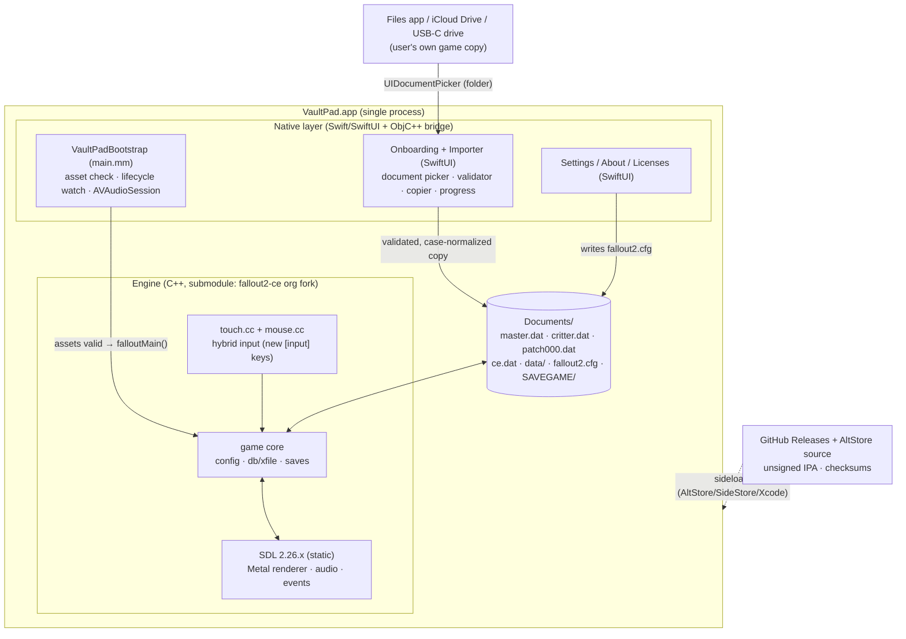

# VaultPad — Fallout 2 (Community Edition) for iPadOS

## Product Requirements & Technical Feasibility Document

| | |
|---|---|
| **Document version** | 1.0 |
| **Date** | 2026-07-17 (all sources accessed this date unless noted) |
| **Status** | Complete feasibility study + implementation blueprint |
| **Evidence base** | Full source audits of `alexbatalov/fallout2-ce` @ `e97087b` (upstream, dormant) and `fallout2-ce/fallout2-ce` (active fork); GitHub API metadata; issue/PR history; release-artifact inspection (v1.3.0 IPA downloaded and analyzed); license texts read verbatim; App Store precedent research |
| **Supporting evidence** | [docs/research/](research/) — seven detailed source-grounded reports with file paths, line numbers, and URLs |
| **Intended reader** | An engineering agent (human or AI) that will execute this plan end-to-end without a second broad research phase |

> **Legal note:** the licensing/trademark/App Store analysis in this document is research, not legal advice.

---

## Table of contents

- [A. Executive verdict](#a-executive-verdict)
- [B. Current state](#b-current-state)
- [C. Gap analysis](#c-gap-analysis)
- [D. Architecture recommendation](#d-architecture-recommendation)
- [E. Complete implementation roadmap](#e-complete-implementation-roadmap)
- [F. Phased release plan](#f-phased-release-plan)
- [G. Exact first-week plan](#g-exact-first-week-plan)
- [H. Repository file map](#h-repository-file-map)
- [I. Risk register](#i-risk-register)
- [J. Effort estimate](#j-effort-estimate)
- [K. Go/no-go experiments](#k-gono-go-experiments)
- [L. Final recommendation](#l-final-recommendation)
- [M. Research findings by topic (areas 1–22)](#m-research-findings-by-topic)
- [N. Proposed scripts and CI workflows](#n-proposed-scripts-and-ci-workflows)
- [O. Sources and access dates](#o-sources-and-access-dates)

---

## A. Executive verdict

### Verdict: **Strong go** — as an *iPad productization* project, not an engine port.

Fallout 2 Community Edition already compiles for iOS, already ships an unsigned IPA that people sideload onto iPads today (~8,100 lifetime IPA downloads of upstream releases), and already contains a touch-gesture layer, case-insensitivity shims, and Files-app-visible storage. **The engine exists; the consumer-ready application does not.** Every gap between those two states is documented in open GitHub issues with no owner: game-data import is an iTunes-File-Sharing ritual, resolution must be hand-typed into an INI file, the on-screen keyboard cannot be summoned in barter, gameplay input is a virtual trackpad users don't expect, backgrounding silently risks progress loss, and no reproducible "clone → sign → Run" developer experience exists. All of these are application-layer and integration problems — precisely the kind of work a small, focused project can finish. None require deep engine archaeology.

The single most important strategic finding: **do not build on `alexbatalov/fallout2-ce`.** Upstream is dormant (last commit 2025-02-16; zero commits in 2026). The live project is the community continuation **`fallout2-ce/fallout2-ce`** — 880 commits ahead, active the day of this research, with merged iPad-specific touch work (PR #377), Restoration Project support in beta, and a maintainer team that reviews PRs in days. Building there converts this project from "resurrect a dead codebase" to "contribute a polished iPad experience to a living one."

### Scores

| Dimension | Score | Rationale |
|---|---:|---|
| **Overall technical feasibility** | **9/10** | Engine builds, runs, and is played on modern iPads today. Remaining work is UI/UX/packaging, not engine reimplementation. The one point withheld: UI readability at native iPad resolutions needs a real engine change (no UI scaling exists). |
| **Time to first working build** | **9/10** | `cmake --preset ios` → generated Xcode project → set team → Run is expected to work within hours on day one (upstream CI proved the identical commands green on macos-14 as recently as 2026-01-18). |
| **Touch-control difficulty** | **6/10** | A tablet-validated direct-touch PR (#304) exists unmerged; the fork already merged HUD tap-through and multi-finger gestures (#377). The remaining hybrid-mode work (direct touch in world view, per-screen modes, touch targets) is real but bounded; issue #398 is a ready-made backlog. |
| **Legal / distribution risk** | **6/10** (moderate, manageable) | License (Sustainable Use License) explicitly permits free non-commercial distribution of modified builds — upstream itself ships IPAs. Trademark is the live wire: neutral branding is mandatory. Tail risk: the engine's reverse-engineering provenance is an untested fair-use position; ZeniMax has tolerated it publicly for 4+ years. Sideload distribution has zero gatekeepers; App Store is a coin-flip first attempt. |
| **Community interest** | **7/10** | ~8.1k iOS + ~31.6k Android downloads on a *dormant* repo, press coverage (iMore 2024), 2011-era forum demand, and a #1 unsolved pain-point list users keep commenting on. Niche but proven and underserved. |
| **Originality** | **5/10** | The engine, iOS target, and IPA all exist. Originality lies in the product layer: native importer, auto-configuration, hybrid touch controls, lifecycle safety, reproducible builds. Honest framing: "the polished iPad app the engine deserves," not "Fallout 2 ported to iPad." |
| **Estimated engineering effort** | **~55–75 engineer-days realistic** to a polished Phase-3 release (optimistic ~35, pessimistic ~110). Phase-2 "usable player build" at ~25–35 days. See [J](#j-effort-estimate). |

### The five facts that decide the verdict

1. **An official unsigned IPA already exists** (`fallout2-ce-ios.ipa`, v1.3.0, 5,717 downloads; fully unsigned — `codesign` reports "code object is not signed at all"; MinimumOSVersion 11.0; arm64). Sideloading it is the current install path, recommended by upstream's own README. → *Research: [01](research/01-build-system-ci-releases.md)*
2. **The build system is one command from an Xcode project** (`cmake --preset ios`, CMake ≥ 3.25, all deps auto-fetched via FetchContent: SDL 2.26.1, zlib 1.3.1, fpattern), but there is no committed Xcode project, no signing scaffolding, no simulator target, and upstream's CI/release workflows are bit-rotted on retired runners. → *[01](research/01-build-system-ci-releases.md)*
3. **Touch is a virtual trackpad and the tap coordinate is thrown away** (`_mouse_simulate_input(0, 0, …)` at `src/mouse.cc:392`) — the single highest-leverage change (direct-touch) is small because the engine already exposes an absolute cursor API, and a working implementation exists in closed PR #304 plus the fork's merged #377. → *[03](research/03-input-touch-keyboard.md)*
4. **There is no display-size query anywhere in the engine** — iPad users must hand-author `f2_res.ini` in the Files app, and the touch layer mis-maps coordinates if the chosen resolution's aspect ratio differs from the screen. Auto-resolution is a ~day of work with outsized UX payoff. → *[04](research/04-rendering-audio-lifecycle-saves.md)*
5. **The license is fine, the name is not.** The Sustainable Use License permits exactly this project (free, non-commercial, modified, notice-preserving). But upstream sets the app display name to "Fallout 2" — a ZeniMax word mark they have C&D'd mobile products over (Fortress Fallout, 2015). Neutral branding ("VaultPad") with descriptive-only references is required. → *[02](research/02-licensing-distribution-appstore.md)*

---

## B. Current state

What exists today, split by repo. "Upstream" = `alexbatalov/fallout2-ce` @ `e97087b` (2025-02-16, dormant). "Fork" = `fallout2-ce/fallout2-ce` (active; 880 commits ahead). Quality: ✦ = works well · ◐ = works with friction · ✗ = broken/missing.

| Capability | Exists now | Quality | Evidence | Work remaining |
|---|---:|---:|---|---|
| iOS compile target (CMake preset → Xcode project, arm64 device) | Yes (both) | ✦ | `CMakePresets.json` `ios` preset; `CMakeLists.txt:7-15,317-335`; CI green on macos-14 (run 2026-01-18) | Pin modern runner/Xcode; add simulator preset; signing scaffolding |
| Published installable artifact | Yes | ◐ | v1.3.0 `fallout2-ce-ios.ipa`, unsigned CPack ZIP, 5,717 DLs; fork ships rolling `fallout2-ce-ios.zip` | Real `xcodebuild -exportArchive` path; versioned releases; AltStore source JSON |
| Runs on modern iPadOS (17/18) | Yes | ◐ | No launch-failure cluster in issues; #393 = iPadOS 17.5.1, #423 = iOS 18 (friction reports, not crashes) | Device-matrix verification (Phase 0) |
| Game-data loading from app Documents | Yes | ◐ | `chdir(iOSGetDocumentsPath())` `src/win32.cc:39-43`; `UIFileSharingEnabled` + `LSSupportsOpeningDocumentsInPlace` in `os/ios/Info.plist` | Native folder importer with validation (today: manual Finder/iTunes copy; first launch intentionally errors) |
| Case-insensitive file resolution | Yes | ◐ | `compat_resolve_path` `src/platform_compat.cc:313-365`; DAT bsearch `src/dfile.cc:624-635`; the PR #369 `fileFindFirst` fix is merged in both trees (upstream 2025-01-13) | Residual "unable to save" reports remain unresolved (#349, #497 open) — diagnose on-device; normalize case at import time so the runtime shims are never stressed |
| Touch input (gesture recognizer → mouse emulation) | Yes | ◐ | `src/touch.cc` (tap/pan/long-press, 1–2 fingers); trackpad model; `src/mouse.cc:370-430` | Direct-touch/hybrid mode; expose thresholds; fix LIFO gesture queue; sensitivity for touch deltas |
| iPad-specific touch conveniences | Fork only | ◐ | Fork PR #377 (merged 2026-04-29): HUD tap-through, 3-finger ESC, 3-finger Shift, 4-finger F6 quicksave, quick-actions toolbar (`src/platform/ios/quick_toolbar.cc`) | Fork issue #398 backlog: touch targets, drag, sliders, per-screen touch modes |
| On-screen keyboard (text entry) | Partial | ◐ | `beginTextInput()` at exactly 3 call sites: char naming, save naming, file dialog (`input.cc:1030-1038` + call sites) | Barter/quantity dialog has none (#423, open since 2024, still open in fork); add call sites + numeric pad |
| Hardware keyboard / mouse / trackpad | Yes | ✦ | SDL relative-mouse mode (`dinput.cc:96`); wheel handled; SDL 2.26.1 includes iPadOS GCMouse support (iOS 14+) | Verify pointer capture on-device; sensitivity <1.0; document shortcuts |
| Arbitrary internal resolution + widescreen | Yes | ◐ | `_GNW95_init_mode_ex` `svga.cc:102-164` reads `f2_res.ini`; fork migrates to `fallout2.cfg [screen]` | **No display-size auto-detect anywhere**; no safe-area handling; touch/letterbox mismatch `touch.cc:102-103` |
| UI scaling for readability | No | ✗ | Only integer `SCALE_2X` with 640×480 floor — rejected at 11" iPad logical res (`svga.cc:125-135`) | Engine work: render-scale decoupling or curated per-device resolution presets |
| Rendering backend on iOS | Yes | ✦ | SDL_Renderer → Metal via fallback (hint requests "opengl" which doesn't exist on iOS, `svga.cc:176`); streaming 8→32-bit texture | Set correct hint; consider vsync flag; palette-fade hot path fine at iPad res |
| Audio | Yes | ◐ | SDL audio 22050 Hz S16 stereo (`audio_engine.cc:96-113`); ACM decoder in-tree | No AVAudioSession/interruption handling; focus-loss pause only |
| App lifecycle handling | No | ✗ | Zero `SDL_APP_*`/`SDL_AddEventWatch` usage; focus-loss = 8 Hz freeze loop (`input.cc:1021-1028`); `SDL_QUIT` → `exit()` bypasses `gameExit()` | Background autosave, TERMINATING/LOWMEMORY handling, safe present ordering |
| Saves on-device | Yes | ◐ | `data/SAVEGAME/SLOTxx/` under Documents; survives updates; visible in Files | Case bug (#393); no iCloud; no auto-backup; "unable to save" reports (#349) |
| Config auto-generation | Partial | ◐ | `fallout2.cfg` written on clean exit only (`settings.cc:35-41`); `f2_res.ini`/`ddraw.ini` never generated | Generate on first run with detected resolution |
| Mod loading (patch DATs, loose files, `mods/`) | Yes (fork) | ◐ | patch000–999.dat auto-load (`game.cc:1372-1378`); fork adds `mods/` + `mods_order.txt`, RPU beta ("99% compatible" — maintainer, 2026-07-10) | iOS mod UX = file drops; RPU experimental; TCs needing deep sfall not supported |
| CI producing iOS artifact | Yes | ◐ | `ci-build.yml` iOS job (Debug, unsigned); pinned to retired `macos-13` upstream; fork runs current runners | Modern workflow: simulator build, unsigned IPA, release automation |
| Reproducible dev experience ("clone → sign → Run") | No | ✗ | No committed/instrumented Xcode project; bundle id + team hardcoded/absent; CMake ≥3.25 undocumented | `setup.sh`, signing via env/xcconfig, docs |
| Multiplayer | No | — | Zero networking code in `src/` (verified grep) | Out of scope — state plainly |
| App Store presence | No | — | Sideload-only history for the whole ecosystem | Optional Phase-4 attempt (§M.18) |

**Distinctions the reader must keep** (per research standards): the *engine* exists and *builds successfully*; it is *playable with friction* on iPad; a *consumer-ready application* does not exist. Simulator support does **not** exist (device-only presets). "Runs on iPadOS" is evidenced by user reports on 17.5.1/18 (anecdotal but multiple, no contradicting reports); Phase 0 re-verifies on current hardware.

---

## C. Gap analysis

### Already solved (inherit for free)

- iOS/arm64 compilation, CMake presets, Xcode project generation (`cmake --preset ios`).
- Auto-fetched dependencies (SDL 2.26.1, zlib 1.3.1, fpattern) — no manual installs.
- Landscape-only iPad/iPhone bundle with launch screen, icon, Files-visible Documents (`UIFileSharingEnabled`, `LSSupportsOpeningDocumentsInPlace`).
- Case-insensitive path resolution for loose files and DAT lookups (with one known residual bug).
- A complete touch gesture recognizer (trackpad model) and 2-finger-pan scroll that users like.
- Hardware keyboard/mouse/trackpad support via SDL relative-mouse mode; wheel → list scrolling.
- On-screen keyboard for the three text-entry flows that call `beginTextInput()`.
- Arbitrary internal resolution rendering with aspect-preserving letterboxing; HRP-style interface-bar config.
- ACM/MVE decoding in-tree; sound working (past music bugs were data-path/case issues, not codec bugs).
- 64-bit-clean interpreter; single-threaded engine that is trivial for any A-series/M-series chip.
- Save system under Documents, surviving app updates.
- (Fork) HUD tap-through, multi-finger shortcuts, quick-actions toolbar, `mods/` loader, RPU-beta, sfall hooks, `[screen]`/`[ui]` config migration.

### Partially solved (works with friction — the product core)

| Gap | Today | Target |
|---|---|---|
| Game-data onboarding | Manual Finder/iTunes copy into Documents after an intentional first-launch error; iTunes can't copy folders (#387); users confused (#385) | Native first-launch importer: `UIDocumentPickerViewController` folder pick → validate → copy with progress → normalize case → write config → play |
| Resolution | Hand-typed `f2_res.ini`; README tells users to look up device logical points | Auto-detect display, write config, offer 2–3 curated scale presets per device class |
| Touch controls | Trackpad-only in world view; direct-touch exists only in fork HUD/UI screens | Hybrid default: direct tap in world + UI, trackpad toggle, long-press action menu, bigger targets (#398 list) |
| Text/numeric entry | 3 flows summon keyboard; barter quantity does not (#423) | `beginTextInput()` at quantity dialog + numeric keypad; audit all text fields |
| Saves | Work, but "unable to save" reports persist (#349, #497 — the #369 case fix is already merged, so root cause is not fully closed) and no backgrounding safety | Reproduce + fix residual save failures on-device; autosave on background; export/import via Files |
| First-run content (`ce.dat`) | Fork requires its `ce.dat` archive for full features; shipped *beside* the IPA, not bundled (macOS-only bundling, `CMakeLists.txt:521,584-605`); missing = silent degradation | Bundle `ce.dat` into the iOS app Resources and load from bundle path (small CMake + `TryLoadBaseCEMod` change; clearly upstreamable) |
| Lifecycle | Accidental freeze-loop safety; progress lost on suspension kill | `SDL_AddEventWatch` background/terminate handlers + autosave |
| Audio | SDL defaults only | AVAudioSession category + interruption handling; verify BT/silent-switch behavior |
| Developer experience | Possible but undocumented, unsigned, regenerated project loses team settings | `setup.sh` + xcconfig signing + committed docs; CI on current runners; simulator preset |
| Distribution | Unsigned zip renamed `.ipa` on a dormant repo; rolling zip on fork | Versioned releases, real IPA export, AltStore/SideStore source JSON, TestFlight track |

### Missing (build new)

- Native onboarding/importer UI (SwiftUI over UIKit document picker) — does not exist in any fork.
- Asset validation (required-file manifest, size/hash sanity, Steam-vs-GOG layout detection, capitalization repair).
- Automatic configuration writer (resolution, `IFACE_BAR_*`, sound paths) with device-class presets.
- Lifecycle autosave + low-memory/terminate handling.
- AVAudioSession integration.
- iCloud save sync (deliberately postponed to Phase 4; a fork contributor's iCloud experiment exists in `tectiv3/fallout2-ce` — unmerged).
- In-app settings surface (control mode, cursor speed, toolbar visibility, sensitivity for touch).
- Reproducible signed-build pipeline + release automation + acceptance tests.
- All neutral branding assets (icon, launch screen, name) — required, since upstream's "Fallout 2" display name is a trademark hazard.

### Unknown → requires testing (each has a go/no-go experiment in [K](#k-gono-go-experiments))

1. Does the current fork build run acceptably on iPadOS 18/26-era hardware end-to-end (fresh install → char creation → combat → save/load)? (Expected yes; verify Day 1.)
2. Does SDL 2.26.1 relative-mouse + GCMouse behave correctly with Magic Keyboard trackpad on current iPadOS (pointer capture, wheel, right-click)? (SDL-version-sensitive; test early; upgrade SDL if needed.)
3. Does `SDL_StartTextInput` reliably raise/dismiss the iPadOS keyboard on current OS builds, and does hardware-keyboard presence suppress it gracefully?
4. Security-scoped folder copy throughput from iCloud Drive / external SSD for ~600 MB–2 GB of game data (progress UI needs real numbers).
5. RPU-on-iOS stability (fork claims 99% desktop compatibility; zero iOS-specific RPU evidence).
6. Whether backgrounding during palette fades/movies can present after `WILLENTERBACKGROUND` (watchdog kill vector) — needs on-device reproduction attempt.

---

## D. Architecture recommendation

### D.1 Base repo: fork the community continuation, not upstream

**Decision: maintain a long-lived downstream fork of `fallout2-ce/fallout2-ce` (the active org), consumed as a git submodule by a separate product repo, with every engine-side change submitted upstream.**

**Implementation note (2026-07-18):** VaultPad is the downstream product repository. To keep the project in one GitHub repository, the pinned engine snapshot is published on its `engine-vaultpad` branch and consumed by `main` as the `engine/` submodule. This preserves reproducible pins without creating a second public fork.

Rationale, in order of weight:

1. Upstream `alexbatalov/fallout2-ce` is dormant (last commit 2025-02-16; open PRs from 2022 unreviewed). Basing there means owning every future engine fix alone.
2. The org fork is alive (multiple merges weekly, pushed the day of this research), already contains the only merged iPad-input work (PR #377), RPU-beta mod support, hook scripts, the `mods/` loader, and the `[screen]`/`[ui]` config consolidation.
3. The fork demonstrably accepts outside iOS PRs (tectiv3's #377: opened 2026-04-15, merged 2026-04-29), and its own issue #398 is a wishlist that overlaps this PRD's touch backlog — engine-side patches (direct-touch config, text-input call sites, display auto-detect, lifecycle, ce.dat bundling) have a realistic upstream path, which keeps the permanent diff near zero.
4. A patch-based overlay (quilt-style) is strictly worse here: the engine surface we touch is small and upstreamable; a submodule pinned to our fork branch (`vaultpad`, rebased on org `main`) gives reproducible builds *and* clean upstream PRs.

What stays permanently ours (never upstreamed): the native launcher/importer app layer, branding, release automation, AltStore source, and docs. What is upstream-bound: everything in C++ under `src/`.

### D.2 Process/app architecture

**One process, two phases: a native UIKit/SwiftUI onboarding layer that runs *inside* SDL's app lifecycle before the engine initializes.**

Constraint driving the design: on iOS, SDL2 owns `UIApplicationMain` via its `SDL_main` shim, and it cannot be invoked twice in one process. Therefore the launcher cannot be a separate "app before the app." Instead:

- `main.mm` (ours) hands control to SDL as today. At the top of the engine's `main()` (before `SDL_Init` and before `falloutMain()`), a small Objective-C++ bridge (`VaultPadBootstrap`) checks asset validity in `Documents/`.
- If assets are missing/invalid, the bridge creates its own `UIWindow` with a `UIHostingController` hosting the SwiftUI onboarding flow (explain → pick folder → validate → copy with progress → configure), and pumps the runloop (`CFRunLoopRunInMode` ticks / dispatch semaphore) until onboarding completes. This "native UI before SDL video init" pattern is standard for SDL iOS ports; the SDL window does not exist yet, so there is no compositing conflict.
- On completion (or if assets were already valid), the bridge tears down its window, writes/refreshes `fallout2.cfg`, and falls through to `falloutMain()`. The game runs exactly as it does today.
- The same bridge installs the app-lifecycle event watch (`SDL_AddEventWatch` for `SDL_APP_WILLENTERBACKGROUND` / `SDL_APP_TERMINATING` / `SDL_APP_LOWMEMORY` — autosave + present-fence) and configures `AVAudioSession` before `SDL_Init(SDL_INIT_AUDIO)`.
- Settings/About/Import-repair are reachable from in-game via a small "gear" path: v1 keeps this simple — quitting to the launcher requires an app relaunch (documented); v1.x can add an in-process return path (tear down SDL video, re-present launcher — feasible but not v1-critical).

**Language split:** SwiftUI for all launcher UI; Swift for validation/copy logic (`FileManager`, security-scoped URLs); Objective-C++ only for the thin bridge into engine globals/config (one `.mm`, mirroring the existing `paths.mm`). Do **not** build importer UI inside the C++ engine (weeks of custom-widget work for a worse result), and do not rewrite engine input in Swift.

**Fallback (if runloop-pumping proves fragile on some iPadOS version):** initialize SDL video first, then present the importer as a UIKit modal over SDL's own window (`SDL_GetWindowWMInfo` → root VC). Both patterns are proven in shipping SDL ports; pick whichever survives Experiment K-3.

### D.3 File importer design (the flagship feature)

Flow (maps to research area §M.3):

1. First launch → SwiftUI explainer: "VaultPad needs data files from your own copy of Fallout 2 (GOG/Steam/Epic/CD). Nothing is downloaded."
2. "Select Fallout 2 Folder" → `UIDocumentPickerViewController(forOpeningContentTypes: [.folder])` (folder picking is fully supported on iPadOS; SwiftUI `fileImporter(isPresented:allowedContentTypes: [.folder])` is the modern wrapper).
3. `startAccessingSecurityScopedResource()` on the returned URL; enumerate with `FileManager.enumerator` (+ `NSFileCoordinator` for iCloud coherence).
4. **Validate before copying** (manifest-driven): required `master.dat`, `critter.dat` (DAT2 header check + plausible size ranges), optional `patch000.dat`, `data/` tree; detect Steam layout (uppercase names), GOG layout (extra installer files), Fallout 1 data (reject with a specific message), missing music (warn: sound folder mapping), free-space check (need ≈ source size + 10%).
5. **Copy into the sandbox** (`Documents/`), lowercasing every path component on write, streaming with byte-accurate progress (`Progress` + SwiftUI `ProgressView`), skipping junk (installer EXEs, saves from other machines optionally imported separately). Copy-in — not access-in-place — because the engine `chdir`s into a plain POSIX directory, in-place security scopes don't survive relaunch for folder trees cleanly, and external-drive/iCloud latency would stall the engine's synchronous I/O. iCloud-resident files: request download (`FileManager.startDownloadingUbiquitousItem`) and show per-file state; external SSD: works through the same picker, just slower — show throughput.
6. Write config: `[screen] resolution_x/y` from the detected display (§D.5), sound paths if music was found in a nonstandard place, and defaults.
7. Deposit the bundled `ce.dat` into `Documents/` (or better: engine patch to read it from the app bundle — upstreamable; the fork currently ships it *beside* the IPA and silently degrades without it).
8. "Play." Subsequent launches skip straight to the game (fast validation only). Settings offers **Repair / Replace / Remove imported data** and **Add mod files** (v1.x).
9. Errors are specific and recoverable: name the missing file, show what was found, offer "pick again" and a help link. ZIP import: defer to v1.x (ZIPFoundation); GOG-offline-installer parsing (innoextract compiles for iOS but adds product/legal surface): documented as explicitly out of scope for v1.

### D.4 Input architecture

- **Default: hybrid mode** (see §M.5 for the full A/B/C evaluation). Direct-touch everywhere the fork already made direct (UI screens, HUD tap-through, quick toolbar) **plus** direct-tap in the world view (tap ground = move, tap NPC = interact under current cursor mode), with the trackpad model available as a setting and automatically used when a pointer device connects.
- Engine-side: introduce `[input] touch_mode = hybrid|trackpad|touch` + threshold/sensitivity keys (today the fork's mode flags are runtime-only, set per screen, hardcoded); make `game_mouse.cc:1466-1472`'s iOS trackpad-forcing respect the setting; reuse tectiv3's unmerged "touchscreen always-on" branch and roginvs's PR #304 as references. Fix the two latent input bugs while in there: gesture queue LIFO (`std::stack` → deque, `touch.cc:37`) and touch-coordinate letterbox mismatch (`touch.cc:102-103` must subtract `SDL_RenderGetLogicalSize` letterbox offsets).
- Long-press = right-click/action-menu stays; two-finger tap = right-click stays; 2-finger pan scroll stays (users like it). Add first-run controls overlay (one screen, dismissible) — the fork's gestures are excellent but undiscoverable.
- Keyboard/quantity entry: add `beginTextInput()` to the move-items/barter quantity dialog (`inventory.cc` `inventoryQuantitySelect`) with `UIKeyboardTypeNumberPad` via SDL hint `SDL_HINT_RETURN_KEY_HIDES_IME` + text-input rect; audit every numeric field.
- Pointer devices: keep SDL relative-mouse mode (correct behavior exists); verify GCMouse pointer capture on current iPadOS (Experiment K-4); sensitivity slider already extended to 0.25–2.5 in the fork.

### D.5 Display & configuration

- First run: query `SDL_GetCurrentDisplayMode`/`SDL_GetRendererOutputSize`, write `[screen] resolution_x/y` = device logical points (aspect-exact), eliminating the hand-edited-INI step entirely. Offer per-device presets in Settings: **Native** (sharp, small UI) and **Comfort** (~1.5× UI: internal ≈ points ÷ 1.5, min 640×480) — see §M.7 for the per-device table. Integer 2× is only lawful on 13" iPads (688×516 ≥ 640×480); elsewhere fractional stretch via SDL logical size (choose linear filtering for fractional, nearest for integer).
- Safe areas: iPads are currently rectangular displays for fullscreen SDL purposes; add `SDL_GetDisplayUsableBounds` guard anyway (future hardware, Stage Manager). Keep `UIRequiresFullScreen=true` for v1 (Split View/Stage Manager resizing is out of scope; documented).

### D.6 Saves

- V1: status quo location (`Documents/data/SAVEGAME/`) + background autosave (lifecycle watch) + Settings "Export saves" (zip to Files) / "Import saves". Saves remain user-visible in the Files app — a feature, keep it.
- iCloud sync: **postponed to Phase 4** (deliberate): CloudKit/ubiquity containers add conflict semantics the engine can't express; tectiv3's fork has an unmerged "validate cloud slot integrity" experiment worth studying first. Files-app manual copy to iCloud Drive covers the interim.

### D.7 Build system & repo layout

Single CMake superbuild → one generated Xcode project (primary), with a committed-workspace fallback if CMake's Swift support fights back (Experiment K-2 decides in week 1):

```text
vaultpad/                            # product repo (this repo)
├── engine/                          # git submodule → <you>/fallout2-ce, branch `vaultpad` (fork of fallout2-ce org)
├── ios/
│   ├── Bootstrap/                   # main.mm, VaultPadBootstrap.mm/h (launcher bridge, lifecycle watch, AVAudioSession)
│   ├── Launcher/                    # Swift + SwiftUI: Onboarding, Importer, Validator, Settings, About/Licenses
│   ├── Resources/                   # Assets.xcassets (original art only), LaunchScreen, localized strings
│   └── Config/
│       ├── Info.plist.in
│       ├── VaultPad.xcconfig        # bundle id, versions, deployment target (iOS 15+ proposed)
│       └── Signing.template.xcconfig# DEVELOPMENT_TEAM placeholder; real file gitignored
├── cmake/                           # superbuild modules (AddEngine.cmake, SwiftGlue.cmake)
├── scripts/
│   ├── setup.sh                     # checks tools → submodule init → cmake preset → opens Xcode
│   ├── build-ipa.sh                 # unsigned RelWithDebInfo IPA (CI parity)
│   └── sync-upstream.sh             # fetch org main, rebase `vaultpad` branch, report conflicts
├── tests/                           # XCTest: DAT validator, layout detection, case normalizer, config writer
├── docs/                            # PRD (this file), INSTALL.md, CONTROLS.md, MODS.md, TROUBLESHOOTING.md, research/
├── .github/workflows/               # ci.yml, release.yml, upstream-watch.yml
├── CMakeLists.txt                   # superbuild root: add_subdirectory(engine) + target_sources(ios app layer)
├── CMakePresets.json                # vaultpad-ios, vaultpad-ios-sim, vaultpad-macos-dev
├── README.md
├── LICENSE.md                       # Sustainable Use License (inherited; whole-work terms) + modification notice
└── THIRD_PARTY_NOTICES.md           # SDL (zlib), zlib, fpattern (MIT), engine provenance & disclaimers
```

Key build decisions:

- **Engine consumed via `add_subdirectory(engine)`** with a small upstreamable CMake option (`FALLOUT_EXTRA_SOURCES`/`FALLOUT_SPLASH_HOOK`) letting the superbuild inject the Bootstrap/Launcher sources and our Info.plist/bundle id into the existing executable target — avoids maintaining a separate static-lib split of the engine.
- **Signing**: `DEVELOPMENT_TEAM` comes from `ios/Config/Signing.xcconfig` (gitignored; template committed) or `VAULTPAD_TEAM_ID` env → CMake `CMAKE_XCODE_ATTRIBUTE_DEVELOPMENT_TEAM`. Regenerating the project never loses the team again.
- **Simulator preset** (`vaultpad-ios-sim`: `-DCMAKE_OSX_SYSROOT=iphonesimulator -DCMAKE_OSX_ARCHITECTURES=arm64`) — upstream has none; needed for CI tests and fast UI iteration of the launcher.
- **Versioning**: SemVer; `v0.1` first sideloadable, `v1.0` = Phase 3 exit. Engine submodule SHA recorded in every release's notes. Bundle id: `com.<owner>.vaultpad` (never `com.alexbatalov.*`, never containing "fallout").
- **Upstream sync**: weekly `upstream-watch.yml` opens a PR when `fallout2-ce/fallout2-ce@main` moves; `sync-upstream.sh` rebases the `vaultpad` engine branch.

### D.8 CI & distribution (summary; details §N, §M.14, §M.17)

- CI on `macos-15` (Xcode pinned explicitly — upstream died partly of runner rot; pin *and* alert on deprecations): sim build + XCTests; unsigned device build + IPA artifact; clang-format/SwiftLint; docs link check.
- Release on tag: RelWithDebInfo unsigned IPA + SHA256 + AltStore source JSON update + GitHub Release with engine SHA. TestFlight lane (needs App Store Connect API-key secrets — cannot run on public forks) added when a paid account exists.
- Distribution ladder: **GitHub Releases + AltStore/SideStore source (day one) → TestFlight beta (Phase 3) → AltStore PAL EU/JP/BR (Phase 3/4) → App Store attempt (Phase 4, never load-bearing)**.

### D.9 Architecture diagram



---

## E. Complete implementation roadmap

Sequential, numbered; each task lists **Goal · Work · Files/modules · Depends on · Acceptance · Risk · Effort (realistic engineer-days) · Upstream?**. Phases in [F](#f-phased-release-plan) group these tasks. "Engine" paths are inside the submodule; "App" paths inside `ios/`.

### Phase 0 — feasibility spike

**1. Environment setup & build verification**
- Goal: prove the engine builds today with current tools.
- Work: install Xcode (current stable) + CLT, CMake ≥ 3.25 (`brew install cmake`); clone `fallout2-ce/fallout2-ce`; `cmake --preset ios && cmake --build --preset ios-debug`; also run the macOS preset for a desktop sanity build.
- Files: engine `CMakePresets.json`, `CMakeLists.txt`.
- Depends: none. Acceptance: `out/build/ios/Debug-iphoneos/fallout2-ce.app` exists; macOS build launches to the "no game data" error. Risk: low. Effort: 0.5d. Upstream: n/a.

**2. Physical-device deployment & playability smoke test**
- Goal: the game running on your iPad from your Xcode, and a 30-minute play session log.
- Work: open generated `fallout2-ce.xcodeproj`, set team + unique bundle id, Run; copy game data (GOG copy) + `ce.dat` via Finder File Sharing; play: intro, char creation, Arroyo temple combat, save, load, background/foreground, BT keyboard + trackpad probe.
- Depends: 1. Acceptance: all smoke items pass or are logged as defects; note iPadOS version, device, fps feel, thermal. Risk: low-med (signing quirks). Effort: 1d. Upstream: file any new bugs as fork issues.

**3. Decision gate: record Phase-0 findings**
- Goal: confirm "strong go" against reality; freeze the base-repo SHA.
- Work: write `docs/phase0-report.md`; pin engine submodule SHA. Acceptance: every K-experiment marked pass/fail/blocked. Effort: 0.5d.

### Phase 1 — functional developer build

**4. Product repo bootstrap (superbuild + submodule)**
- Goal: `git clone --recursive && ./scripts/setup.sh && open` works for a stranger.
- Work: create fork of org repo → branch `vaultpad`; add as `engine/` submodule; superbuild `CMakeLists.txt` (add_subdirectory + target_sources injection); `CMakePresets.json` (`vaultpad-ios`, `vaultpad-ios-sim`); `setup.sh` (tool checks, submodule init, configure, open); Signing via xcconfig/env.
- Files: App: root CMake, `cmake/*.cmake`, `scripts/setup.sh`, `ios/Config/*`. Engine: possibly a tiny `FALLOUT_EXTRA_SOURCES` hook (PR upstream).
- Depends: 3. Acceptance: fresh macOS machine → clone → setup.sh → set team once → Run on device; project regeneration preserves signing. Risk: med (CMake/Xcode/Swift integration — fallback: committed workspace). Effort: 3d. Upstream: the source-injection hook only.

**5. Rebrand shell (trademark hygiene) — do this before any public artifact**
- Goal: zero ZeniMax marks in anything we distribute.
- Work: display name "VaultPad", new bundle id, original icon + launch screen (commission/generate original non-Vault-Boy art), About screen with SUL text, modification notice, and the disclaimer formula (§M.16); strip "Fallout 2" display-name override.
- Files: App: `ios/Resources/*`, `ios/Config/VaultPad.xcconfig`, About view. Engine: none (display name comes from our plist).
- Depends: 4. Acceptance: `strings`/plist audit shows no "Fallout" in name/icon/bundle id; About shows license + notices. Risk: low. Effort: 2d (art included). Upstream: no.

**6. `ce.dat` bundled + loaded from app bundle**
- Goal: remove one manual copy step and its silent-degradation trap.
- Work: CMake: include generated `ce.dat` in iOS bundle Resources (today macOS-only, `CMakeLists.txt:521,584-605`); engine: extend `TryLoadBaseCEMod` (`game.cc:1340-1349`) with an iOS `CFBundle`/`SDL_GetBasePath` fallback.
- Depends: 4. Acceptance: fresh install + only game data copied → `expand_barter_window` etc. work; no "Error opening base mod" in log. Risk: low. Effort: 1d. **Upstream: yes (clean PR).**

**7. CI pipeline v1**
- Goal: every push proves the build; every tag produces an installable artifact.
- Work: `ci.yml` (sim build + unit tests, unsigned device build + IPA artifact, lint), `release.yml` (RelWithDebInfo IPA + SHA256 + release upload), `upstream-watch.yml`; pin Xcode via `xcode-select`; runner-deprecation alerting (schedule job checking runner-images announcements).
- Depends: 4. Acceptance: green badge; tag → downloadable unsigned IPA that sideloads. Risk: low-med. Effort: 2d. Upstream: no (but mirror fixes to fork's workflows as PRs when useful).

### Phase 2 — usable player build

**8. Display auto-configuration + letterbox/touch fix**
- Goal: no user ever types a resolution.
- Work: engine: on first run (missing `[screen]` keys) query `SDL_GetCurrentDisplayMode`/output size → write logical-points resolution; subtract logical-size letterbox offsets in `touch.cc:102-103`; honor `SDL_GetDisplayUsableBounds`. App: Settings preset picker (Native/Comfort per §M.7 table) rewriting `[screen]` keys.
- Files: engine `svga.cc`, `touch.cc`, `settings.cc`; App Settings view.
- Depends: 4. Acceptance: fresh install renders pixel-aspect-correct fullscreen on 11"/13"/mini without config edits; taps land where fingers touch at any aspect. Risk: low. Effort: 2d. **Upstream: yes.**

**9. Native importer MVP (§D.3)**
- Goal: first-launch folder import replaces the Finder ritual.
- Work: SwiftUI onboarding + `fileImporter` folder pick; validator (manifest, DAT2 header, Steam/GOG/FO1 detection); case-normalizing streaming copier with progress + cancel; free-space and iCloud-download handling; config write; "Play".
- Files: App `ios/Launcher/*` (Onboarding.swift, Importer.swift, Validator.swift, CopyEngine.swift), `ios/Bootstrap/VaultPadBootstrap.mm`; tests in `tests/`.
- Depends: 4 (5,6,8 parallel-friendly). Acceptance: GOG-macOS, GOG-Windows, and Steam-Windows folder layouts all import to a bootable game with zero manual steps; wrong folder → specific, recoverable error; 1 GB import shows accurate progress and survives app-switch. Risk: med. Effort: 7d. Upstream: no (app layer).

**10. Lifecycle safety (backgrounding, termination, low memory)**
- Goal: no silent progress loss; no watchdog kills.
- Work: engine: `SDL_AddEventWatch` — on `WILLENTERBACKGROUND`: fence presents + trigger quicksave-equivalent autosave (reuse sfall `AutoQuickSave` machinery); handle `TERMINATING`/`LOWMEMORY`; route `SDL_QUIT` through `gameExit()` (today `exit()` bypasses config save, `input.cc:956-958`).
- Files: engine `input.cc`, `main.cc`, `loadsave.cc` glue; App bootstrap registers the watch.
- Depends: 4. Acceptance: background mid-combat → relaunch after force-kill → autosave slot restores; no GPU-background crash in 50 background/foreground cycles incl. during palette fades/movies. Risk: med (fade/movie present paths). Effort: 3d. **Upstream: yes.**

**11. Hybrid touch controls v1**
- Goal: tap-to-act in the world view; trackpad demoted to an option.
- Work: engine: `[input] touch_mode` key; make `game_mouse.cc` iOS trackpad-forcing conditional; direct-tap = move cursor to tap point then click (API exists: `_mouse_set_position`); keep long-press action menu (tune: long-press in touch mode = open menu at finger); fix gesture-queue LIFO; apply sensitivity to touch pan deltas. App: Settings toggle + first-run controls card.
- Files: engine `touch.cc`, `mouse.cc`, `game_mouse.cc`, `settings.cc`; App Settings/Overlay.
- Depends: 8. Acceptance: full Temple-of-Trials + Klamath session played touch-only in direct mode by a fresh user without instruction beyond the controls card; mode switch persists; trackpad mode unchanged for its fans. Risk: med-high (edge scrolling & combat feel need iteration). Effort: 6d. **Upstream: yes (mirrors fork issue #398's own wishlist).**

**12. Text & numeric entry completeness**
- Goal: every input field reachable touch-only.
- Work: engine: `beginTextInput()` in `inventoryQuantitySelect` (+ numeric keyboard hint), audit dialogs (`dbox`, char editor age/name, save naming already OK); ensure keyboard doesn't obscure the active field (temporary viewport shift or reposition).
- Files: engine `inventory.cc`, `input.cc` (add `beginNumericInput()`).
- Depends: 4. Acceptance: barter any quantity, name character, name save, enter Vault door code — all touch-only. Risk: low. Effort: 1.5d. **Upstream: yes (fixes upstream #423, open since 2024).**

**13. Save-failure diagnosis + save management**
- Goal: zero "Error saving game!" reports on clean installs; saves exportable.
- Work: reproduce #349/#497 on-device (suspect: leftover uppercase dirs from manual copies vs importer-normalized trees; verify `MAPS`/`SAVEGAME` creation paths); fix root cause or auto-repair at import; App: Settings → export saves (zip → share sheet) / import saves.
- Depends: 9. Acceptance: 20 save/load cycles across 3 maps on fresh import; export→delete app→reinstall→import→load works. Risk: med (bug may be data-dependent). Effort: 2.5d. Upstream: the engine fix, yes.

**14. Audio session correctness**
- Goal: audio behaves like an iPad game.
- Work: App bootstrap: `AVAudioSession` category `.playback` (or `.ambient` per product choice re: silent switch — decide in beta), interruption + route-change observers pausing/resuming the SDL audio device; verify BT latency acceptable.
- Depends: 4. Acceptance: phone call / Siri / AirPods disconnect during music+speech → resumes without desync or crash; silent-switch behavior documented. Risk: low-med. Effort: 1.5d. Upstream: engine-side hooks maybe; session code stays app-side.

**15. Beta 1 (v0.1) — sideload release**
- Goal: real users.
- Work: tag; unsigned IPA + AltStore source JSON; INSTALL.md (AltStore/SideStore/Sideloadly/Xcode paths); TROUBLESHOOTING.md; feedback issue templates.
- Depends: 5,6,7,8,9,10,11,12,13,14. Acceptance: an outside tester with no help installs and reaches Klamath. Risk: low. Effort: 1.5d.

### Phase 3 — polished iPad release

**16. Touch backlog pass (fork #398 list + beta feedback)** — save-screen/alert touch modes, pressed states, slider handling, inventory tap-to-pick/tap-to-drop drag alternative, skilldex dismissal, quick-toolbar END TURN/END COMBAT buttons. Depends: 11,15. Acceptance: #398 checklist green. Risk: med. Effort: 5d. **Upstream: yes.**

**17. Keyboard/mouse/trackpad certification** — full shortcut map doc; verify pointer capture, wheel, right-click on Magic Keyboard + BT mouse; auto-switch input profile on pointer connect/disconnect. Depends: 11. Acceptance: desktop-parity checklist on Magic Keyboard iPad. Risk: low (SDL upgrade to 2.30.x is the lever if issues — vendored tag bump). Effort: 2d. Upstream: SDL bump PR if needed.

**18. Performance & battery pass** — instrument fps/thermals; cap present rate sanely (vsync flag), verify palette-fade hot path at native res; idle-frame skip if measurable. Depends: 15. Acceptance: ≥3h battery at 50% brightness on 11" Pro (measure; adjust claim to data), no thermal throttle in 60-min session. Risk: low. Effort: 2d. Upstream: yes.

**19. Settings & polish surface** — control mode, cursor speed, toolbar toggle, resolution preset, screen-edge scroll margin, About/licenses, "reset to defaults". Depends: 11. Effort: 3d. App-side.

**20. Docs & website-lite** — README (screenshots-free or original-art only), CONTROLS.md, MODS.md (vanilla+UP+language packs supported; RPU experimental; TC status table from §M.11), FAQ. Depends: 15. Effort: 2d.

**21. TestFlight track (optional but recommended)** — paid dev account; neutral-branding review pass; internal→external beta. Depends: 15. Risk: med (beta review). Effort: 2d.

**22. v1.0 public release** — tag, release notes, AltStore source update, announce (r/classicfallout, NMA, fork Discord — coordinate with fork maintainers; offer upstream PRs as the announcement's spine). Depends: 16–20. Effort: 1d.

### Phase 4 — optional enhancements (each independently shippable)

**23. iCloud save sync** (CloudKit or ubiquity container; last-writer-wins + local backup; study tectiv3's cloud-slot-integrity branch). Effort: 8d. Risk: med-high.
**24. Mod import UX** (`mods/` folder browser, zip import, RPU one-tap with warnings). Effort: 5d.
**25. App Store attempt** (§M.18 playbook: neutral metadata, ScummVM precedent in review notes, 4.7/2.5.2 argument prepared; expect appeal cycle). Effort: 4d + review latency.
**26. Apple Pencil affordances** (hover = cursor preview on M2+ iPads; Pencil tap = precise click — SDL delivers Pencil as touch; hover needs UIKit hover gesture → inject cursor move). Effort: 3d.
**27. External display / AirPlay** (SDL second-display fullscreen; UI stays on iPad). Effort: 3d.
**28. Accessibility extras** (§M.21: remap surface, larger-cursor option, color-filter shader via SDL render color mod, reduced-motion = disable palette-cycling water?). Effort: 5d.
**29. iPhone layout tuning** (secondary target per constraints: quick toolbar layout, minimum-res guard). Effort: 3d.

---

## F. Phased release plan

| Phase | Name | Contents (roadmap tasks) | Exit criteria | Calendar (1 engineer) |
|---|---|---|---|---|
| **0** | Feasibility spike | 1–3 | Game plays on your iPad from your Xcode build; findings doc; K-experiments 1–4 answered | 2–3 days |
| **1** | Functional developer build | 4–7 | Stranger-reproducible clone→sign→Run; CI green; branded shell; ce.dat bundled | +1 week |
| **2** | Usable player build (v0.1 beta) | 8–15 | Touch-only new-player playthrough to Klamath; native import; autosave-on-background; no manual config | +3–4 weeks |
| **3** | Polished iPad release (v1.0) | 16–22 | #398 backlog green; kb/mouse certified; docs complete; TestFlight or AltStore-source distribution live | +2–3 weeks |
| **4** | Enhancements | 23–29 | Per-feature | ongoing |

---

## G. Exact first-week plan

Assumes: an Apple-silicon Mac, an iPad (any modern one; ideally 11" Pro), a free or paid Apple ID, and a legally owned Fallout 2 copy (GOG build recommended — cleanest layout). Free Apple ID = 7-day resign + 3-app limit; fine for week 1.

**Day 1 — build & run the existing engine (do not design anything today)**
```bash
xcode-select --install                       # if needed
brew install cmake                           # ≥ 3.25 required by presets schema v6
git clone https://github.com/fallout2-ce/fallout2-ce.git
cd fallout2-ce
cmake --preset ios                           # generates out/build/ios/fallout2-ce.xcodeproj
open out/build/ios/fallout2-ce.xcodeproj     # set Team + unique bundle id → Run on iPad
```
- Also grab their prebuilt for comparison: latest `continious` release → `fallout2-ce-ios.zip` (contains unsigned Debug IPA + `ce.dat`) → sideload via Sideloadly/AltStore.
- Copy game data: iPad connected → Finder → Files tab → drag `master.dat`, `critter.dat`, `patch000.dat`, `ce.dat`, `data/` (lowercased) into the app.
- Files to inspect while builds run: `CMakePresets.json`, `CMakeLists.txt` (iOS blocks), `src/win32.cc`, `src/touch.cc`, `src/mouse.cc:373-570`, `src/platform/ios/`, `os/ios/Info.plist`, `.github/workflows/ci-build.yml`.
- Expected output: game playable on the iPad; Day-1 defect log. **Blockers that stop the project**: engine won't compile under current Xcode (unlikely — CI was green 2026-01-18 on Xcode 15.4; if it happens, bisect SDK breakage — budget 1 day) or won't run on your iPadOS version (no evidence of this anywhere; would demand immediate investigation).

**Day 2 — structured playability audit (Experiments K-1, K-4, K-5)**
- Touch-only session: char creation → Temple → Klamath. Score every interaction from the §M.4 table. Verify fork gestures (3-finger ESC, 4-finger F6, HUD tap-through, quick toolbar via `[ui] quick_toolbar_visible=1` in `fallout2.cfg`).
- Magic Keyboard/BT mouse session: pointer capture, wheel, right-click, Escape, hotkeys.
- Text entry: character naming, save naming (keyboard should appear); barter quantity (keyboard should NOT appear — confirm the gap).
- Backgrounding: 20 cycles incl. during a palette fade; force-kill; note progress loss.
- Output: annotated defect/behavior matrix → becomes Phase-2 acceptance baseline.

**Day 3 — repo bootstrap (roadmap task 4 start)**
```bash
gh repo fork fallout2-ce/fallout2-ce --clone=false   # your engine fork
cd /Users/chrissotraidis/GitHub/vaultpad
git submodule add https://github.com/<you>/fallout2-ce engine
git -C engine checkout -b vaultpad
# superbuild skeleton: CMakeLists.txt, CMakePresets.json, scripts/setup.sh
```
- Prove: superbuild configures, builds the engine unmodified, `setup.sh` opens the project, signing survives regeneration (xcconfig/env → `CMAKE_XCODE_ATTRIBUTE_DEVELOPMENT_TEAM`).
- Output: `./scripts/setup.sh` → Run works end-to-end from the *product* repo.

**Day 4 — Swift-in-superbuild spike (Experiment K-2) + simulator preset**
- Add one trivial SwiftUI screen via the bootstrap bridge, compiled through the CMake-generated project. If friction exceeds a day → flip to the committed-workspace fallback (decision recorded).
- Add `vaultpad-ios-sim` preset; build + boot in Simulator (engine will error on missing data — fine; the launcher is what needs the Simulator).
- Output: architecture decision D.2/D.7 validated with running code.

**Day 5 — importer walking skeleton (Experiment K-3)**
- `fileImporter` folder pick → security-scoped enumeration → copy one file into Documents with progress → relaunch persistence. Test sources: local folder, iCloud Drive folder (undownloaded), USB-C drive.
- Output: measured copy throughput + the K-3 verdict; importer task de-risked.

**Day 6 — first engine patches (tasks 6 & 8 start)**
- `ce.dat` from bundle (CMake + `TryLoadBaseCEMod`); display auto-config write-on-first-run; letterbox/touch offset fix. Open both as **upstream PRs to the fork** the same day (small, reviewable, goodwill-building).
- Output: fresh install on iPad = correct fullscreen resolution with zero config edits.

**Day 7 — CI + week-1 report**
- `ci.yml` (sim + device-unsigned + IPA artifact) green on GitHub; runner/Xcode pinned.
- Write week-1 report against Phase-0/1 exit criteria; update this PRD's risk register with observed reality; groom Phase-2 tasks.

---

## H. Repository file map

Verified paths in the **engine** (fork `fallout2-ce/fallout2-ce` @ `aa439ef`; identical paths exist upstream @ `e97087b` unless marked *fork-only*). This is where an implementing agent will spend engine time.

| Path | What it is / why you'll touch it |
|---|---|
| `CMakeLists.txt` | Single build file. iOS deployment target/arch (`:8-9`), iOS sources block, bundle config (id, device family, plist), CPack IPA packaging (`install → Payload`, ZIP ext `ipa`); ce.dat bundling currently macOS-only (`:521,584-605`) — task 6 |
| `CMakePresets.json` | Schema v6 (CMake ≥ 3.25). `ios` configure preset (Xcode generator, `CMAKE_SYSTEM_NAME=iOS`, empty code-sign identity), `ios-debug`/`ios-release` build presets. No simulator preset — we add one |
| `os/ios/Info.plist` | `UIFileSharingEnabled`, `LSSupportsOpeningDocumentsInPlace`, `UIRequiresFullScreen`, landscape-only, `UIApplicationSupportsIndirectInputEvents`. Superbuild substitutes our own plist |
| `os/ios/LaunchScreen.storyboard`, `os/ios/AppIcon.xcassets/` | Black launch screen + single 1024 icon — replaced by original VaultPad art |
| `src/win32.cc` | Cross-platform `main()` despite the name: iOS `chdir(iOSGetDocumentsPath())`, touch/mouse SDL hints, `SDL_Init`. Bootstrap hook point (task 4/D.2) |
| `src/platform/ios/paths.mm` | The only ObjC++ file: returns sandbox Documents path. Pattern to follow for new bridge code |
| `src/platform/ios/quick_toolbar.cc/.h` | *Fork-only.* iOS skill toolbar (8 buttons, engine-window rendered, keycode injection). Extend with END TURN/END COMBAT (task 16) |
| `src/touch.cc/.h` | Gesture recognizer (tap/pan/long-press, thresholds `:16-18`), LIFO queue bug (`:37`), letterbox-blind coordinate mapping (`:102-103`), *fork:* `gUseTouchscreenMode`/`gUsePanMode` runtime flags + cursor-warp (`:274-283`) |
| `src/mouse.cc` | Gesture→mouse dispatch (`_mouse_info`); *fork:* HUD tap-through (`:373-421`), 3/4-finger gestures (`:448-493`), direct-tap in absolute mode (`:515-528`); sensitivity application (mouse-only) |
| `src/dinput.cc` | SDL mouse/keyboard device layer; relative-mouse mode (⇔ fullscreen in fork); wheel accumulation |
| `src/input.cc` | Event pump (`_GNW95_process_message`), key normalization tables, `beginTextInput()/endTextInput()` (`:1030-1038`), focus-loss freeze loop (`:1021-1028`), `SDL_QUIT → exit()` bypass — tasks 10/12 |
| `src/kb.cc` | Engine keyboard state machine + ASCII tables (no `SDL_TEXTINPUT` consumption — US-QWERTY only) |
| `src/game_mouse.cc` | Cursor modes, right-click cycling, action menu, edge scrolling (`:2334-2417`); *fork:* iOS trackpad-forcing (`:1466-1472`) — the direct-touch gate, task 11 |
| `src/svga.cc` | All rendering: window/renderer/streaming texture, `SDL_RenderSetLogicalSize`, resolution decision (`_GNW95_init_mode_ex`), palette-fade full re-blit hot path; display auto-config lands here (task 8) |
| `src/settings.h/.cc` | *Fork-only.* Typed config registry: `[screen] resolution_x/y/windowed/scale`, `[ui]` incl. `quick_toolbar_visible`; our `[input]` keys join here |
| `src/game_config_migration.cc` | *Fork-only.* One-time `f2_res.ini` → `fallout2.cfg` migrator |
| `src/game_config.cc` | Config file I/O + defaults; written on clean exit only (`settingsExit(true)`) |
| `src/game.cc` | `gameDbInit` DAT mounting order (`:1331-1456` fork), `TryLoadBaseCEMod` ce.dat probe (`:1340-1349` fork), splash |
| `src/db.cc`, `src/xfile.cc`, `src/dfile.cc` | Virtual filesystem: xbase stack, DAT2 reader (case-insensitive bsearch), gzip sniffing |
| `src/platform_compat.cc` | Case-insensitivity shims (`compat_resolve_path`), path separator conversion, `compat_mkdir_recursive` (fork) |
| `src/file_find.cc` | Directory iteration; contains the merged #369 case fix (`:33`) |
| `src/loadsave.cc` | Save/load slots, `SAVEGAME` path assembly, save-naming text input; autosave glue target (task 10/13) |
| `src/inventory.cc` | Drag loop, barter panes, quantity dialog (`inventoryQuantitySelect` — **no keyboard**, task 12); *fork:* pan-mode scroll |
| `src/audio_engine.cc` | SDL audio device + mixer (22050/S16/stereo); AVAudioSession hooks attach around it (task 14) |
| `src/sound_decoder.cc`, `src/movie_lib.cc` | In-tree ACM + MVE decoders (no external codec deps) |
| `src/sfall_*.cc` | sfall compatibility layer; *fork:* + `sfall_script_hooks.cc`, `sfall_ext.cc` (`mods/` loader), etc. Mod support scope, §M.11 |
| `src/interpreter*.cc` | Script VM (64-bit-safe ProgramValue) |
| `third_party/{sdl2,zlib,fpattern}/CMakeLists.txt` | FetchContent pins: SDL `release-2.26.1`, zlib `v1.3.1`, fpattern v1.9. SDL tag bump = one-line change (task 17 lever) |
| `.github/workflows/ci-build.yml` | *Fork:* iOS job on `macos-14`: preset → build → cpack → zip(IPA + ce.dat) → per-merge `continious` prerelease (`:141-189, 458-516`) |
| `.github/workflows/release.yml` | Tagged-release path (RelWithDebInfo; upstream copy references a deleted toolchain file — broken there, fixed in fork) |
| `README.md` | iOS install ritual + "Controls on iPad" section (fork `:74-96`) — the UX we're replacing; keep as fallback docs |
| `SFALL_COMPATIBILITY.md` | *Fork-only.* Authoritative mod-feature matrix for §M.11 claims |

Product-repo layout: see [D.7](#d7-build-system--repo-layout).

## I. Risk register

| # | Risk | Prob. | Impact | Detection test | Mitigation |
|---|---|---:|---:|---|---|
| R1 | ZeniMax/Microsoft acts against fallout2-ce upstream (RE-provenance copyright claim) — all forks fall | Low | Fatal | Monitor github/dmca repo + fork issues (automate in upstream-watch) | Neutral branding; no assets ever; nothing mitigates the tail risk itself — accept consciously; 4 years of public tolerance documented |
| R2 | Trademark C&D over naming/branding | Low-Med | High | First contact letter | "VaultPad" brand, no marks in name/icon/bundle/store metadata; descriptive references only; disclaimer (§M.16); rename plan on file |
| R3 | Engine no longer compiles on a future Xcode/SDK | Med (eventually) | Med | CI runs on every push + scheduled weekly | Pinned Xcode + runner alerting; SDL tag bump path; we own a fork so we can patch |
| R4 | Fork governance changes (org stalls like upstream did) | Med | Med | upstream-watch cadence report | Submodule pins exact SHA — we're never blocked; our engine patches are small and rebased; worst case we maintain the ~6-patch series alone |
| R5 | Direct-touch combat feels bad in practice (why the fork kept trackpad in world view) | Med | Med | Task 11 beta feedback; K-1 Day-2 audit | Hybrid with per-context modes + user toggle; keep trackpad default-able; iterate with testers; PR #304's phone-vs-tablet lesson: iPad-first tuning |
| R6 | Runloop-pumped native UI inside SDL main misbehaves on some iPadOS version | Low-Med | Med | K-3 spike (Day 5) | Documented fallback: modal over SDL window; both patterns prototyped in week 1 |
| R7 | Residual save failures (#349/#497 class) persist after importer normalization | Med | Med | Task 13's 20-cycle matrix on 3 devices | On-device reproduction with instrumented logging; auto-repair pass at import; fork Discord + issue collaboration |
| R8 | SDL 2.26.1 pointer/keyboard regressions on current iPadOS (GCMouse, StartTextInput) | Low-Med | Med | K-4 (Day 2, 15 min) | Bump vendored SDL tag to latest 2.30.x/2.32.x (one line + retest); SDL2 is still maintained for fixes |
| R9 | Apple Beta/App Review rejects TestFlight/App Store attempts | Med (TF) / High-ish first-pass (AS) | Low (channels are optional) | Submission itself | Sideload + AltStore source is the load-bearing channel by design; App Store playbook in §M.18 with ScummVM precedent; never promise store availability |
| R10 | Sideloading policy tightens (Apple kills free-account sideloading or AltStore breaks) | Low | High | Ecosystem news; AltStore/SideStore releases | Multiple channels (Xcode-build, Sideloadly, SideStore, PAL in EU/JP/BR); source-build path always works for developers |
| R11 | SUL interpretation dispute (someone argues our distribution is "commercial") | Very low | Med | Licensor contact | Zero monetization anywhere; notices kept; proactive courtesy email to Batalov + fork maintainers (task 22 prep) |
| R12 | Import throughput/UX fails on iCloud-resident or USB sources (multi-GB TC mods later) | Low-Med | Low-Med | K-3 measurements | Streaming copy + resumability; document "download folder locally first" fallback |
| R13 | Usability: 1998 UI too small at native res; users bounce | Med | Med | Beta feedback vs Comfort presets | §M.7 presets; 13" integer 2×; long-term: upstream render-scale work (explicitly out of v1 scope) |
| R14 | Maintainer burnout / single-owner project repeats upstream's pattern | Med | Med | — | Aggressive upstreaming shrinks the owned surface; docs written for handoff; small permanent diff is the whole architecture |

## J. Effort estimate

Engineer-days, single senior engineer comfortable in C++ and Swift. **Assumptions**: fork base; no App Store in scope; art either simple original work or budgeted separately; test devices available: one 11" iPad + borrowed 13"/mini for the matrix. "Realistic" ≈ optimistic × 1.7 with integration friction; pessimistic assumes two nasty surprises (R6 + R7 both firing).

| Work item | Optimistic | Realistic | Pessimistic |
|---|---:|---:|---:|
| First successful local build (device) | 0.5 | 1 | 3 |
| Reproducible Xcode build (superbuild, setup.sh, signing, sim preset) | 2 | 4 | 8 |
| Files-based importer (picker, validator, copier, errors) | 4 | 7 | 12 |
| Automatic configuration (display detect, presets, config writer) | 1 | 2 | 4 |
| Basic touch fixes (letterbox, LIFO, sensitivity, thresholds) | 2 | 3 | 6 |
| Polished direct-touch controls (hybrid mode + #398 backlog) | 6 | 10 | 20 |
| Keyboard & mouse certification | 1 | 2 | 5 |
| Save import/export + lifecycle autosave + save-bug diagnosis | 3 | 5.5 | 10 |
| Audio session | 1 | 1.5 | 3 |
| CI (ci/release/upstream-watch) | 2 | 3 | 6 |
| Branding + About/licenses + settings surface | 3 | 5 | 8 |
| Documentation (INSTALL/CONTROLS/MODS/FAQ) | 2 | 3 | 5 |
| Testing passes (matrix execution ×2 rounds) | 4 | 6 | 12 |
| Beta cycle + release prep (v0.1 + v1.0) | 3 | 5 | 9 |
| **Total to v1.0 (Phases 0–3)** | **34.5** | **58** | **111** |
| Phase 4 (optional): iCloud saves | 4 | 8 | 15 |
| Phase 4 (optional): mod import UX | 3 | 5 | 9 |
| Phase 4 (optional): App Store attempt | 2 | 4 | 8 + review latency |

Calendar reality for one person at ~4 productive days/week: **v0.1 beta ≈ 5–7 weeks in; v1.0 ≈ 11–15 weeks in** (realistic column). Two contributors compress Phase 2/3 nearly linearly (app layer and engine layer parallelize cleanly).

## K. Go/no-go experiments

Smallest tests that answer the largest uncertainties. K-1..K-4 belong in week 1; all have binary outcomes.

**K-1. Does the current fork build & play on modern iPadOS?**
Steps: Day-1 plan (§G): `cmake --preset ios` → Xcode → Run; import data; play 30 min touch-only; repeat with the prebuilt `continious` IPA via Sideloadly. Success: builds under current Xcode; game reaches Klamath; no crash. Failure action: bisect SDK breakage (budget 1 day) — if the engine fundamentally can't run on current iPadOS, the project premise is wrong (no evidence anywhere suggests this).

**K-2. Can SwiftUI sources live in the CMake superbuild?**
Steps: add one SwiftUI screen through `target_sources` injection + bridge; build device + simulator. Success: compiles/links/presents in ≤1 day of effort. Failure action: adopt committed-workspace fallback (D.7) — costs project-file hygiene, changes nothing user-visible.

**K-3. Folder import through the Files picker, end-to-end**
Steps: minimal app: `fileImporter([.folder])` → security-scoped enumerate → copy 700 MB test tree into Documents with progress; sources: local, iCloud-undownloaded, USB-C SSD; relaunch and verify. Success: full tree lands correctly (case-lowered), progress accurate, iCloud files download-on-demand, no sandbox errors. Measures: MB/s per source (informs progress UI). Failure action: none plausible short of OS bugs — folder pickers are mainstream API; degrade to file-multi-select if a specific source type misbehaves.

**K-4. Do pointer + keyboard behave under SDL 2.26.1 on current iPadOS?**
Steps: with K-1 build: Magic Keyboard trackpad + BT mouse: move, click, right-click, wheel scroll in inventory, Escape, hotkeys, character-name text entry (on-screen keyboard appears when no HW keyboard; suppressed when attached). Success: parity with desktop behavior; engine cursor authoritative; no visible system pointer. Failure action: bump vendored SDL tag (`third_party/sdl2/CMakeLists.txt`, one line) to latest SDL2 release; retest.

**K-5. Barter quantity keyboard fix is as small as it looks**
Steps: patch `inventoryQuantitySelect` with `beginTextInput()`/`endTextInput()`; on-device: does the iPad keyboard rise, do typed digits land (engine consumes scancodes), does dismissal restore the game view? Success: type "250" in barter. Failure action: if SDL scancode synthesis from the software keyboard misses digits, route through `SDL_TEXTINPUT` in a small engine shim (bounded, still upstreamable).

**K-6. Background/foreground robustness (watchdog + progress loss)**
Steps: scripted 50 background/resume cycles (incl. during palette fade + MVE movie playback); force-kill while suspended; relaunch. Success: no crash logs (check Console), documented progress-loss behavior → validates task 10's design. Failure action: none — this experiment *quantifies* the problem task 10 fixes; a crash during fade confirms the present-fence requirement.

**K-7. RPU on iOS (Phase-4 scoping only)**
Steps: on a desktop fork build verify RPU baseline; then copy the same RPU `mods/` tree to the iPad build; play the RP intro hour. Success: parity with desktop fork behavior. Failure: mark RPU "desktop-fork only" in MODS.md — no v1 impact.

**K-8. AltStore source JSON install path**
Steps: host a minimal source JSON pointing at a CI IPA; add to AltStore; install; update flow. Success: one-tap-ish install + update. Failure action: ship plain IPA + instructions (works regardless).

## L. Final recommendation

**Should this project be built?** Yes — strong go. It is unusually well-de-risked for a hobby-scale flagship: the engine runs on the target hardware today, every remaining gap is documented in open issues nobody owns, the license explicitly permits the distribution model, and the active fork gives engine changes a merge path measured in weeks.

**Strongest reason to build it:** the gap between "technically runs on iPad" and "feels like an iPad game" is exactly the kind of product/platform work that is fully within reach — folder import, auto-config, hybrid touch, lifecycle safety, reproducible builds — and nobody in the ecosystem is doing it (the fork's own maintainers wishlist it in #398 but focus on sfall/mod parity).

**Strongest reason not to:** the foundation is legally gray at its root — the engine descends from a binary decompilation, distributed under a fair-code license, of IP that Microsoft actively sells. Four years of public tolerance (including upstream's own IPA releases) is strong evidence of practical safety, but a single hostile decision upstream of you ends the project, and no engineering mitigates that.

**What should the public claim be?** "VaultPad is a free, open-source iPad-native experience for Fallout 2 Community Edition: import your own legally purchased game files through the Files app and play with touch controls designed for iPad. Unofficial; contains no game content; not affiliated with Bethesda, ZeniMax, or Microsoft."

**What should not be claimed?** Never: "play Fallout 2 on iPad" as an offer of the game itself; "port" (implies you moved the game); App Store availability (until real); RPU/total-conversion compatibility beyond §M.11's evidence table; performance/battery numbers before measuring; any affiliation with the fallout2-ce projects beyond "built on."

**Most defensible first release:** the Phase-2 v0.1 sideload beta — unsigned IPA + AltStore source, importer + autosave + hybrid touch, neutral branding, README-honest about status. It is upstream's own distribution model with the sharp edges filed off, and every part of it sits squarely inside the license's explicit permissions and the ecosystem's 4-year enforcement history.

**Genuine platform port, iPad productization, or repackaging?** iPad productization, unambiguously. The port exists (upstream did it in 2022). Pure repackaging would be dishonest — the importer, input, lifecycle, and build-system work are real engineering. Say "productization"; deliver port-quality polish.

**Compared with other classic-game projects:**

| Candidate | Engine state on iOS | Legal shape | Differentiation opportunity | Verdict vs this project |
|---|---|---|---|---|
| **Fallout 2 CE (this)** | Builds + ships IPA today; friction-level gaps | Fair-code license; data user-supplied; RE-derived tail risk | Huge: nobody owns the iPad UX | **Baseline — best effort/reward** |
| Diablo I (DevilutionX) | Mature port, iOS builds exist, polished touch UI already shipped by the project itself | GPL-ish (Sustainable-style? — no: GPL-compatible); very mature | Low: DevilutionX already did the productization | Weaker — the interesting work is done |
| Heroes III (VCMI / fheroes2*) | VCMI iOS exists incl. TestFlight; active teams | Open engines, user data | Medium; teams already ship mobile | Weaker: crowded, and *fheroes2 is HoMM2 |
| OpenRA | Desktop-first; no real iOS story; Mono/.NET runtime on iOS is heavy | GPL | Technically expensive port (a true port, not productization) | Much larger, riskier project |
| OpenTTD | Official-ish iOS history exists; touch UI dated | GPL; free base data (OpenGFX) — cleanest legal shape of all | Medium | Legally nicest, but demand niche overlaps existing builds |
| ScummVM | Already on the App Store, officially | GPL, exemplary governance | ~None | No opportunity — it's the end-state role model |

Fallout 2 CE is the standout precisely because it sits in the middle: engine done, product missing, audience demonstrated, competition absent. If a *second* project is ever wanted, fallout1-ce (same architecture, same gaps, no active fork — riskier) or contributing VaultPad's importer/input patterns upstream to the fork for Android parity are the natural adjacencies.

---
## M. Research findings by topic

Condensed, decision-oriented answers to the 22 research areas. Every claim traces to [docs/research/](research/) (file paths/line numbers) or to linked primary sources; access date 2026-07-17 throughout.

### M.1 Existing iOS/iPadOS support

- **Official iOS target**: yes, in both upstream and fork — CMake `ios` preset → Xcode-generator project; arm64 device only; **no Simulator target**; deployment target iOS 12 (CMake) while shipped IPAs say MinimumOSVersion 11.0 (upstream v1.3.0) / 10.13 (fork artifact — a harmless plist leak). No Xcode project is committed; it's generated into `out/build/ios/`.
- **IPA published**: upstream v1.3.0 (2024-04-21) `fallout2-ce-ios.ipa`, **completely unsigned** (not even ad-hoc), 5,717 downloads; fork publishes a per-merge unsigned **Debug** IPA in the rolling `continious` prerelease, zipped with `ce.dat`. Both are CPack ZIPs of `Payload/*.app` — no `xcodebuild -exportArchive`, no provisioning anywhere.
- **Works on current iPadOS**: user-evidenced on 17.5.1 and iOS 18 (issues #393, #423 — friction reports, not launch failures); no crash-on-launch cluster exists. Verify on-device Day 1 (K-1).
- **Latest-Xcode compile**: fork CI green on macos-14/Xcode 15.4 as of 2026-07-17 (per-merge); upstream's own workflows pin retired runners (macos-13/12) and reference a deleted toolchain file — **upstream cannot release today without workflow surgery**.
- **Deprecated APIs**: none of consequence — the iOS layer is one `.mm` using `NSSearchPathForDirectoriesInDomains` + SDL 2.26.1. The risk is SDL-version-related, not Apple-API-related.
- **Signing/provisioning docs**: none. "Clone → select team → Run" fails today on: undocumented CMake ≥ 3.25, no committed project, signing lost on regeneration, no simulator, network needed at configure (FetchContent: SDL release-2.26.1, zlib v1.3.1, fpattern — all auto-fetched, nothing manual).
- Full detail: [research/01](research/01-build-system-ci-releases.md), [research/07](research/07-fork-ios-audit.md).

### M.2 Current installation experience (verbatim reality, fork build)

1. Obtain: GitHub → fork's `continious` release → `fallout2-ce-ios.zip` → extract IPA (+ `ce.dat`).
2. Install: sideload — AltStore or Sideloadly (README-recommended), SideStore, or build in Xcode. Free Apple ID: 7-day expiry, 3-app cap. TrollStore: dead on modern iPadOS (≤17.0 only).
3. First launch: **intentional error** — "Couldn't find/load text fonts" — whose only purpose is to create the sandbox so the app appears in Finder/iTunes File Sharing.
4. Import: connect iPad to a computer → Finder → device → Files tab → drag `master.dat`, `critter.dat`, `patch000.dat`, `ce.dat`, `data/` into the app. **Names must be lowercase** (iOS APFS is case-sensitive; Steam installs are uppercase). iTunes-on-Windows cannot copy folders (#387); the app's Documents also appear in the Files app (`LSSupportsOpeningDocumentsInPlace`), which is the workaround path users discover on their own.
5. Resolution: hand-edit `fallout2.cfg` → `[screen] resolution_x/y` = device logical points (README suggests values; default is 640×480 stretched).
6. Config: `fallout2.cfg` auto-writes on clean exit only; `ddraw.ini` never generated. Saves land in `Documents/data/SAVEGAME/SLOTxx/` — survive app updates, deleted on uninstall, visible in Files (import/export = manual file copies).
7. Friction inventory: sideload learning curve → deliberate first-run error → computer required → folder-copy trap on Windows → case-sensitivity traps → ce.dat easily missed (silent feature loss) → manual resolution → barter needs a hardware keyboard. Every step is a documented open issue; §D.3/E.9 erase steps 3–7.
- Sources: fork README `:74-96`; [research/04 §5](research/04-rendering-audio-lifecycle-saves.md), [research/06](research/06-ecosystem-community-names.md), [research/07](research/07-fork-ios-audit.md).

### M.3 Native file-import system (design answers)

- **Folder selection**: fully supported — `UIDocumentPickerViewController(forOpeningContentTypes: [.folder])` / SwiftUI `fileImporter(allowedContentTypes: [.folder])` returns a security-scoped folder URL (works for iCloud Drive, On My iPad, SMB, USB drives).
- **Copy vs in-place**: **copy into sandbox**. The engine `chdir`s into Documents and does synchronous POSIX I/O; in-place access would require keeping a security-scoped bookmark resolved for the process lifetime, stalls on iCloud/network latency mid-frame, and breaks File-Sharing visibility. Security-scoped **bookmarks** therefore aren't needed post-import (only during the copy session); store none.
- **iCloud/external sources**: request downloads (`startDownloadingUbiquitousItem`) with per-file status; external SSDs just work through the picker (slower — show MB/s). Copy is resumable per-file; on failure list exactly what's missing.
- **Progress**: byte-based `Progress` across the enumerated manifest (typical GOG install ≈ 550–650 MB; expect seconds from local storage, minutes from iCloud).
- **Validation**: manifest-driven — required: `master.dat`, `critter.dat` (check 4-byte DAT2 signature + size range), `data/` tree presence; optional: `patch000.dat` (warn if absent: US 1.02d needed), music dirs (warn), `ce.dat` (we bundle it — task 6). Detect-and-message: Steam layout (uppercase), GOG extras, **Fallout 1 data** (reject: identifiable by FO1-only files), incomplete copies (list missing), pre-patched RP installs (flag as "experimental content").
- **Capitalization**: normalize every path component to lowercase during copy — this converts the engine's runtime case-shims into a belt-and-suspenders fallback and likely kills the residual save-bug class (#497 hypothesis, verify in task 13).
- **Archives**: ZIP import v1.x (ZIPFoundation); **GOG offline installer ingestion**: technically feasible (innoextract builds as a library), *legally unremarkable* (user's own file, local processing) but product-heavy — out of v1; **Steam without a desktop**: not possible (Steam has no iPad client; data must be extracted on a computer once — document it).
- **Repair/replace/remove**: Settings actions — re-validate, re-import over, delete data keeping saves, delete everything.
- **Layer & language**: SwiftUI views + Swift validator/copier, one Objective-C++ bridge into engine config — see §D.2/D.3 for the full rationale (short: SDL owns the app lifecycle, so the importer runs as native UI inside SDL's process before engine init; building it in engine C++ or as a separate app are both strictly worse).

### M.4 Touch-control audit (what works today)

Model: **virtual trackpad** — pan moves an engine-drawn cursor; taps click *at the cursor*, not the finger (`_mouse_simulate_input(0,0,…)`, `mouse.cc:392` upstream); 1-finger tap = left, 2-finger tap = right (cycles cursor mode), 500 ms long-press = button-held (drag), 2-finger pan = wheel. Fork adds: direct-touch in UI screens, HUD tap-through, quick toolbar, 3-finger ESC/Shift, 4-finger F6. World view remains deliberately trackpad on iOS (`game_mouse.cc:1466-1472` fork). Full per-function evidence: [research/03](research/03-input-touch-keyboard.md), [research/07 §2](research/07-fork-ios-audit.md).

| Interaction | Works? | How today (fork) | Usability | Modification required |
|---|---|---|---|---|
| Walking | Yes | Pan cursor, tap | OK once learned; alien to touch natives | Direct-tap-to-move (task 11) |
| Running | Yes | `running=1` pref or Shift-click (3-finger long-press = Shift) | OK | Expose toggle in Settings |
| Attacking | Yes | 2-finger tap → crosshair, position, tap | Mode cycling undiscoverable | Controls card; tap-target feedback |
| Aimed shots | Marginal | Right-click *on the weapon button* (2-finger tap on HUD) or 'N' | Hidden | Quick-toolbar aimed toggle or menu item |
| Skills/skilldex | Yes | Quick toolbar (8 skills, one tap) or skilldex button | Good (fork win) | Pressed-state feedback (#398) |
| Open doors / talk / loot | Yes | ARROW-mode tap | OK | Direct-tap merge (task 11) |
| Action menu (Look/Use/…) | Marginal | 500 ms hold → vertical drag → release | Fiddly triple-phase | Touch-mode menu: tap-to-select rows |
| Inventory drag | Yes | Long-press-drag (item becomes cursor) | Error-prone (4 px / 500 ms rule) | Tap-pick/tap-drop alternative (#398) |
| Equip/reload | Yes/Marginal | Drag to slot; reload via right-click weapon button cycle | Weak | Same as above + reload in toolbar |
| Pip-Boy | Yes | Direct-touch screen (fork) | Good | — |
| Long lists scroll | Yes | 2-finger pan = wheel; inventory 1-finger pan (fork) | Good | Coefficient tuning |
| Dialogue options | Yes | Direct-touch (fork) | Good | Larger hit rows if feasible |
| Barter | Marginal | Direct-touch + drag; **quantity typing has no keyboard** (#423) | Blocker for large trades | `beginTextInput` numeric (task 12, K-5) |
| Character creation | Yes | Direct-touch (fork); name summons keyboard | Good | — |
| Save/load | Partial | Load screens touch-mode; **save screen is not** (#398); naming summons keyboard | Confusing asymmetry | Save-screen touch mode (task 16) |
| World map | Yes | Trackpad tap (touch mode off in worldmap) | OK | Consider direct-tap destinations |
| Car | Yes | Automatic on travel; fueling = drag | OK | — |
| Small HUD buttons (END TURN etc.) | Yes | Tap-through injection (fork win) | Good | Add to quick toolbar too |
| Text entry (names) | Yes | 3 `beginTextInput` sites | OK | Keyboard-overlap scroll |
| Numeric entry | No (touch-only) | Hardware keyboard or +/- hold | Blocker | Task 12 |
| Cursor-mode access | Yes | 2-finger tap | Undiscoverable | Controls card + optional mode button |

### M.5 Proposed iPad control design (A/B/C evaluation)

- **A — Classic trackpad** (today's model): already implemented and tuned; precise (1998 UI has 20 px targets); familiar to nobody under 40 on a tablet; two-step for every action; edge-scroll runaway quirk. Engineering: zero. Keep as selectable mode and pointer-device fallback.
- **B — Pure direct touch**: matches tablet instinct; taps land where fingers do. Engine cost is *low* for the mechanism (absolute cursor API exists; fork already warps cursor in touchscreen mode; PR #304 proved it) but *medium* for feel: finger occlusion on small targets, hover-dependent affordances (tooltips, target outlines) lost, mis-taps in combat are costly (the explicit reason the fork kept trackpad in gameplay). Going 100% direct requires per-widget hit-target inflation the 1998 UI can't easily give.
- **C — Hybrid (recommended default)**: direct touch in world view + all UI screens + HUD (tap = act; long-press = action menu/aimed options at finger), trackpad mode auto-engaged for pointer devices and user-selectable; 2-finger pan scroll retained; precision assists where B is weakest (slight touch-offset above finger in combat, larger synthetic hitboxes for critters/doors via object-bounds hit test — engine has object bounds from `object_bounds`-style queries).
- **Mode switching**: yes, user-visible (Settings + first-run card): Hybrid (default) / Trackpad / Touch-everywhere. Auto-switch to trackpad-style relative input when GCMouse connects; back on disconnect.
- Also evaluated: configurable gestures (v1: fixed, documented; v1.x: remap table) · cursor speed (exists 0.25–2.5; apply to touch deltas too — gap found in audit) · edge scrolling (keep for trackpad mode; direct mode uses drag-pan; add margin setting) · tap-and-hold timing setting (500 ms → 350–600 ms range) · magnifier loupe (Phase 4; engine-drawn zoom around cursor) · contextual menus (retain engine menu; enlarge rows in touch mode) · haptics (subtle UIImpactFeedback on mode cycle/menu open — app layer, cheap) · **Apple Pencil** (works today as touch; hover on M2+ could preview cursor — Phase 4) · accessibility (§M.21) · left-handed layout (mirror quick toolbar option) · on-screen buttons (quick toolbar is exactly this; keep optional, off by default in v1? — no: **on by default on iPad**, it's good) · UI scaling (resolution presets §M.7; true UI scaling is out of v1) · auto pointer/controller switching (pointer yes; controller — no gamepad support exists at all in the engine; out of scope v1, note for Phase 4+).

### M.6 Keyboard, mouse, and trackpad support

Today (evidence: [research/03 §7](research/03-input-touch-keyboard.md)): SDL relative-mouse mode is permanently on in fullscreen (`dinput.cc`), the OS pointer hides, the engine draws its own cursor — exactly right for this game. Wheel works (lists, map). Right-click works (SDL two-button read). Middle-click: unmapped (engine has no use for it). Modifier keys, Escape, function keys, hotkeys: full desktop parity through SDL scancode normalization; text via US-QWERTY table (no IME — international names limited; documented limitation). Hardware-keyboard presence suppresses the on-screen keyboard (SDL handles it). Pointer capture/GCMouse requires iOS 14+ (target is ≥15 anyway). **SDL 2.26.1 postdates the 2.24 iPadOS pointer rework, so Magic Keyboard/BT mice are expected to behave; K-4 verifies in 15 minutes and the mitigation is a one-line SDL tag bump.** Remapping: none exists; v1 documents fixed bindings, remap UI is Phase 4. Native UIKit work needed: none for pointer/keyboard (SDL suffices); UIKit enters only for the launcher and AVAudioSession.

### M.7 Rendering and display

Pipeline (evidence: [research/04 §1-2](research/04-rendering-audio-lifecycle-saves.md)): SDL2 SDL_Renderer → **Metal** on iOS (via fallback; the code's "opengl" hint doesn't exist there — set it properly to metal or remove, cosmetic), one full-frame streaming texture from an 8-bit palettized surface, `SDL_RenderSetLogicalSize` aspect-preserving letterbox, `ALLOW_HIGHDPI` on, no vsync flag (60 fps sleep limiter), fullscreen-only on iOS, landscape-only, no safe-area logic, **no display query — internal resolution comes from config with a 640×480 default**. Palette-cycling triggers full-surface conversions (fine at these resolutions on A/M-silicon). Refresh: SDL logical present ~60 Hz; ProMotion pacing untested (non-issue for a 60 fps-capped 2D game; verify no jitter). External display/Stage Manager/Split View: out of scope v1 (`UIRequiresFullScreen=true` keeps the OS honest). Orientation: landscape both ways, rotation between them is instant under SDL fullscreen.

Recommended defaults (task 8 auto-writes Native; Settings offers Comfort). Values = logical points (landscape); verify per exact model on device:

| Device | Points (landscape) | **Native** preset | **Comfort** preset (~1.5×) | Integer 2× available? |
|---|---|---|---|---|
| iPad Pro 11" (M4) | 1210×834 | 1210×834 | 806×556 | No (605×417 < floor) |
| iPad Pro 13" (M4) | 1376×1032 | 1376×1032 | — use 2× | **Yes: 688×516** |
| iPad Pro 12.9" (older) | 1366×1024 | 1366×1024 | — use 2× | **Yes: 683×512** |
| iPad Air 11" / iPad (A16) | 1180×820 | 1180×820 | 786×546 | No |
| iPad Air 13" | 1366×1024 | 1366×1024 | — use 2× | Yes: 683×512 |
| iPad mini (A17 Pro) | 1133×744 | 1133×744 | 755×496 | No |

Readability: at Native on 11", HUD buttons ≈ 5–7 mm and font 101 text is small-but-legible at typical lap distance; Comfort trades world-view real estate for ~1.5× UI. **True UI scaling does not exist in the engine** (the only lever is integer `scale`, floor 640×480) — this is the honest limit of v1 and the register's R13. Fractional presets should set linear filtering; integer 2× uses nearest for crisp pixels.

### M.8 Audio

SDL audio device (22050 Hz/S16/stereo/1024), 8 mixed buffers with per-source `SDL_AudioStream` conversion, in-tree ACM decoder; volumes via `[sound]` keys (0–32767). **Zero iOS-specific audio code** — no AVAudioSession category, no interruption observers; pause/resume rides SDL window-focus events only. Consequences to fix (task 14): session category decision (`.playback` = ignores silent switch, standard for games with music; decide in beta), interruption (call/Siri) → pause device, `.ended` → resume; route change (AirPods drop) → device restart; background → device paused by lifecycle watch (task 10). Bluetooth latency: acceptable for a turn-based game; verify no crackle after resume (known SDL-iOS historical wart — K-6 covers it). Evidence: [research/04 §3](research/04-rendering-audio-lifecycle-saves.md).

### M.9 Saving, configuration, and iCloud

Saves: `Documents/data/SAVEGAME/SLOTxx/SAVE.DAT` (+ per-map files); quicksave via sfall `AutoQuickSave`; preserved across updates; erased on uninstall; user-visible in Files (keep!). Desktop-save compatibility: format-identical across CE platforms (same engine, endian-safe I/O) — copying a desktop CE save folder in via Files works today and importer adds a guided path (task 13); classic-engine saves are also loadable by CE per community practice — label "supported, verify per save". Config: `fallout2.cfg` ([screen]/[ui]/[sound]/[preferences]) written on clean exit; our tasks add write-on-first-run + Settings round-trip. iCloud: **defer to Phase 4** (D.6) — manual Files-app copy to iCloud Drive is the interim; automatic sync needs conflict policy the engine can't arbitrate (tectiv3's unmerged cloud-slot-integrity experiment is the starting point). App updates: sandbox persists; add a save-backup zip before engine-submodule bumps that touch save-format-adjacent code (none known to). Evidence: [research/04 §7](research/04-rendering-audio-lifecycle-saves.md).

### M.10 Backgrounding and application lifecycle

Today: focus-loss → `gProgramIsActive=false` → engine spins an 8 Hz poll loop; audio paused; rendering incidentally stops. **No `SDL_APP_*` handling, no save on background, `SDL_QUIT` bypasses `gameExit()`** (config unsaved), suspended-kill = silent progress loss since last manual save; palette-fade/movie code paths can theoretically present after backgrounding begins (watchdog risk — quantify with K-6). Locking = backgrounding. Low-memory: ignored (engine footprint is small — tens of MB — so LOWMEMORY kills are unlikely; handle anyway). Recommendation implemented as task 10: on `WILLENTERBACKGROUND` synchronously fence presents + autosave; on `TERMINATING` flush config; **pause, don't exit** — with resume-to-exact-state (the freeze loop already provides this; we make it deliberate). Orientation/resize: SDL recreates renderer on size-change events; fullscreen landscape-only keeps this rare. Evidence: [research/04 §4](research/04-rendering-audio-lifecycle-saves.md).

### M.11 Mods and compatibility (evidence-bound)

Base decision (fork) is partly mod-driven — full table + links: [research/05](research/05-mod-compatibility.md).

| Mod | Status on the fork (2026-07) | Evidence quality |
|---|---|---|
| High-res/widescreen patches | Obsolete — native arbitrary resolution; HRP `.edg` supported; `f2_res.dat` optional art | Strong (source) |
| Unofficial Patch (UP/UPU) | Expected working (subset of RPU) — unverified directly | Weak/inferred |
| **Restoration Project Updated (RPU)** | **Beta** — README-official; maintainer: "99% compatible"; open crash reports exist | Strong claim, desktop; **zero iOS evidence** (K-7) |
| RP 2.3.3 (killap) | RPU-status-applies, less tested; CZ-edition crash reports | Medium |
| Fallout: Nevada (non-sfall orig.) | Works with two config tweaks (start date, `MovieTimer_artimer4`) | Medium (multi-source, anecdotal) |
| Fallout: Sonora 1.10 | Works (100 %-completion report); edge-case crashes open | Medium |
| Fallout: et tu | **Not working** (both projects confirm; missing hooks/perks.ini) | Strong |
| Fallout 1.5: Resurrection | Not working (upstream evidence); untested on fork | Weak |
| Olympus 2207 | Not working (boots then crashes, maintainer, 2026-04) | Strong |
| Language packs / fan translations | Working (data-level; German-on-iOS confirmed) | Medium |

Mechanics: DAT patches auto-load (`patch000–999.dat`); fork adds sfall-style `mods/` + `mods_order.txt` (how RPU ships); loose files via `data/`. iOS difference: none beyond transfer channel + case (importer normalizes). **V1 scope: vanilla + UP-class data mods + language packs "supported"; RPU "experimental, desktop-parity unverified on iOS"; TCs requiring deep sfall: listed unsupported. Mod-import UI: Phase 4 (task 24); v1 documents the Files-app drop path (works today).** Never claim beyond this table.

### M.12–M.14 Repository, one-command build, CI

Covered normatively in [D.7](#d7-build-system--repo-layout)/[D.8](#d8-ci--distribution-summary-details-n-m14-m17), scripts in [N](#n-proposed-scripts-and-ci-workflows). Direct answers to the checklists:

- Fork vs submodule vs overlay: **downstream fork (engine) + product repo with submodule + upstream-everything policy** (D.1). Not CocoaPods/SPM (engine is CMake; SDL vendored by upstream's FetchContent — don't fight it). Xcode project: **generated** (committed-workspace only as recorded fallback). Bundle id `com.<owner>.vaultpad`; generated files never committed; `Signing.xcconfig` gitignored with template.
- One-command build target state: `git clone --recursive … && ./scripts/setup.sh` → Xcode opens → select team once → Run. Today's blockers and their removals: no docs (write them), CMake ≥ 3.25 unstated (setup.sh checks), signing loss on regen (xcconfig/env → `CMAKE_XCODE_ATTRIBUTE_DEVELOPMENT_TEAM`), no simulator (add preset), network-at-configure (document; optional dependency cache), ce.dat sidecar (bundle it).
- Requirements pinned: macOS 14+, Xcode current-stable (pin exact in CI; document minimum = one that ships iOS 17 SDK), CMake ≥ 3.25 (brew), no other deps.
- CI: sim-build+XCTest / device-unsigned+IPA-artifact / lint / macOS-engine-sanity on push; tag → release IPA + SHA256 + AltStore JSON; weekly upstream-watch; runner-deprecation alerting (upstream died of this — treat as a first-class failure mode). **Cannot be public**: TestFlight/App Store upload (App Store Connect API keys), any real signing (cert+profile secrets) — these run only on the maintainer's repo with secrets configured, never on fork PRs. Release artifacts: **unsigned IPA + source archive** (yes), `.app` zip (no — IPA covers it), Xcode archive (no), patches-only (no — SUL permits binaries).

### M.15 Testing plan

Matrix (execute at v0.1 and v1.0; per-cell = smoke unless marked deep):

- **Devices**: 11" iPad Pro (primary, deep), 13" iPad Pro (deep — integer 2×), iPad Air, base iPad, iPad mini (readability focus), iPhone (launch + import only; secondary target), Simulator (launcher/importer UI only — engine needs data files; usable with test fixtures).
- **Inputs**: touch-only (deep), Magic Keyboard+trackpad (deep), BT keyboard+mouse, Apple Pencil (as touch), pointer hot-plug mid-session.
- **Categories × acceptance criteria**:
  - Fresh install → first launch: reaches onboarding in <3 s; no error dialogs.
  - Import: GOG-Win, GOG-mac, Steam-Win layouts each → playable game, zero manual steps; 1 GB in <90 s local; progress accurate ±5%.
  - Invalid import: FO1 data, empty folder, partial copy → specific error naming the problem + recovery path; no crash.
  - Launch→menu: <5 s warm; correct fullscreen resolution, no letterbox on native preset.
  - Character creation: full flow touch-only incl. name via on-screen keyboard.
  - Combat: Temple of Trials melee + Klamath ranged incl. aimed shot, reload, end-turn — touch-only.
  - Dialogue/barter: complete a barter with typed quantity (task 12) touch-only.
  - Inventory: equip armor+weapon, use stimpak, move 10 items — touch-only, <2 errors per session.
  - World map: travel, random encounter enter/exit, car (later save).
  - Save/load: 20 cycles/3 maps; slot naming; delete/overwrite; export→reinstall→import→load.
  - Text/numeric entry: every field enumerated in M.4 table.
  - Background/resume: 50 cycles incl. during fade/movie/combat; force-kill → autosave restore ≤1 min progress loss.
  - App update: v0.1→v0.2 upgrade keeps saves + config.
  - Orientation: both landscapes, rotation mid-combat.
  - External display (Phase 4 only), Stage Manager: documented-unsupported check (no crash when engaged).
  - Long session: 2 h — no leak growth (Instruments), no thermal throttle, battery data recorded.
  - Low battery/Low Power Mode: fps floor acceptable; low storage: import fails gracefully with space message.
  - Corrupted assets: truncated master.dat → validator catches pre-copy; post-hoc corruption → engine error surfaced with "Repair" pointer.
  - Mods: language pack + UP dat (supported path); RPU (experimental path, K-7).
  - Save migration: desktop CE save imported via Files loads.

### M.16 Licensing and legal (condensed; full: [research/02](research/02-licensing-distribution-appstore.md))

- **License**: Sustainable Use License 1.0 (fair-code, n8n-derived; *not* OSI open source — public claims should say "source-available/fair-code" or "free and open" colloquially with the license named). Permits: use/modify/distribute derivatives **only free of charge for non-commercial purposes**; requires: keep notices, ship the terms, prominent modification notice. No copyleft/source-disclosure duty; non-sublicensable (whole work stays SUL). Verdict: **the intended model — free, source-published, sideload+store — is squarely permitted**; the licensor himself distributes IPAs. Zero monetization anywhere, ever (incl. in-app donation prompts; repo-level sponsor links safer).
- **Copyright**: game data (all DATs/art/audio) = ZeniMax/Microsoft, actively sold — never ship a byte of it, incl. screenshots in store metadata; **no F2 demo exists** (no redistributable data escape hatch); everything pre-import must be original art. Deep-tail risk: engine's decompilation provenance (fallout2-re) is an untested fair-use position; 4 years' tolerance ≠ immunity (R1).
- **Trademark**: "Fallout" enforced on mobile *names* (Fortress Fallout C&D 2015); Vault Boy imagery DMCA'd (2020); engine projects untouched. Rules: no mark in app name/icon/bundle-id/store metadata; descriptive mention only ("compatible with Fallout 2 (1998); requires your copy"); disclaimer: *"VaultPad is an unofficial, free, fair-code engine project. Not affiliated with, endorsed, or sponsored by Bethesda Softworks, ZeniMax Media, or Microsoft. Fallout is a registered trademark of ZeniMax Media Inc. Contains no game content; requires a legally purchased copy."*
- **Separations**: license compliance (green, easy) ≠ copyright (green for us, gray at root) ≠ trademark (managed by naming) ≠ Apple policy (§M.18) ≠ enforcement practice (4-year tolerance documented). Not legal advice.

### M.17 Distribution options (full comparison: [research/02 §E](research/02-licensing-distribution-appstore.md))

| Channel | Feasible | Expiry | User difficulty | Notes |
|---|---|---|---|---|
| Xcode self-build (free ID) | Yes, today | 7 days | High (Mac) | The developer path; always works |
| Paid-account dev/ad-hoc | Yes | 1 yr / 100 devices | Med | For testers |
| **GitHub unsigned IPA + AltStore/SideStore** | **Yes — primary** | 7-day resign (auto) | Med-low, improving (on-device flows) | Upstream's own model; AltStore source JSON = near-one-tap |
| Sideloadly | Yes | 7d/1yr | Med | Windows-friendly |
| TrollStore | No (modern iPadOS) | — | — | ≤ iOS 17.0 only; ignore |
| TestFlight | Yes | 90-day builds, 10k testers | Very low | Beta review (light); neutral branding required; policy-fragile as a forever-channel |
| **AltStore PAL (EU/JP/BR)** | **Yes — best official channel** | None (notarization only) | Low (region-locked) | Free for users since Epic grant; Apple notarization ≠ App Review; Delta's home |
| EU Web Distribution | No | — | — | >1M-install gate |
| App Store | Maybe (§M.18) | None | Lowest | Never load-bearing |

**Recommendation: GitHub+AltStore source at v0.1 (worldwide, zero gatekeepers) → TestFlight at Phase 3 (reach) → PAL when a paid account exists (permanence in EU/JP/BR) → App Store attempt in Phase 4 (upside, revocable).**

### M.18 App Store feasibility

Reasoned estimate (precedent detail: [research/02 §D](research/02-licensing-distribution-appstore.md)): **~50–65% first-submission, ~70–80% eventual with appeals — under strict hygiene**; **<5% with any Fallout branding**. Controlling precedent: **ScummVM — identical architecture (engine reimplementation + user-supplied commercial game data), free, GPL, on the App Store since late 2023 and still listed**. Supporting: Delta/RetroArch/PPSSPP (user-supplied content model blessed under 4.7, 2024), iDOS 3/UTM SE (rejection→rule-change→approval pattern; expect category semantics arguments since a single-game engine is neither "console" nor "PC emulator" literally). Primary rejection vectors, ranked: 5.2.1 IP (any mark/art sighting → rights-documentation demand — the naming rules neutralize); 2.5.2/4.7-scope ("executes imported code" — counter: ScummVM, interpreted data for a fixed engine, user's own documents); 4.3(b) minimum functionality pre-import (counter: polished onboarding; same as every emulator); post-approval takedown on rights-holder complaint (iGBA precedent) — the reason the App Store is never the only channel. Requirement if attempted: no "Fallout" in name/subtitle/keywords/screenshots; review notes citing ScummVM + "no content included; users import files they own."

### M.19 Performance and engineering risk

- Expected performance: trivially CPU/GPU-bound-free — single-threaded 1998 game logic + one full-frame texture upload/frame; any A12+ iPad idles through it (evidence: engine design + zero performance complaints on modern hardware in issues; iPhone-era #81 predates fixes). Watch: palette-fade full-surface conversion at 13" native (measure, task 18).
- Memory: engine data caches are 1990s-scaled (sound cache 448 KB default; app total expected well under 500 MB) — LOWMEMORY exotic. App size sans assets: ~6–9 MB IPA today; with launcher ~15 MB. Storage with assets: 0.6–1.5 GB typical (GOG full + saves); TCs up to ~4 GB.
- Battery/thermal: measure in task 18; nothing structural suggests problems (60 fps cap, small surfaces).
- Crash sources (ranked): script-interpreter aborts from unimplemented sfall surface under mods (bounded by M.11 scope); save-path edge cases (task 13); background-present race (task 10); SDL audio-resume (K-6).
- UB/portability: 64-bit-clean interpreter (audited); little-endian assumed (fine forever on Apple); case-sensitivity handled + importer normalization; no 32-bit assumptions found in audited areas; no networking; dependencies healthy (SDL2 maintained; zlib; fpattern trivial) — deepest dependency risk is **SDL2's long-term iOS support vs an eventual SDL3 migration** (upstream fork will face it; not a v1 concern).
- **Five highest-risk unknowns + fast tests**: (1) direct-touch combat feel → K-1/Day-2 + task-11 beta (prototype in days); (2) native-UI-inside-SDL runloop pattern → K-3 spike (1 day); (3) residual save bug root cause → task-13 instrumented repro (1–2 days); (4) SDL 2.26.1 pointer/keyboard on current iPadOS → K-4 (15 min); (5) background-present watchdog kills → K-6 script (half day).

### M.20 Multiplayer

**Fallout 2 CE has no multiplayer of any kind.** Verified: zero networking code in either tree (no sockets, no SDL_net; the only "socket" hits are prose comments). Vanilla Fallout 2 never had multiplayer. No credible implementation exists to adopt (FOnline is a different engine family). **Out of scope; the PRD makes no multiplayer claims.**

### M.21 Accessibility

Realistic in v1–v1.x: remappable-ish control *modes* + gesture timing settings; cursor-size option (engine-drawn cursor, swappable FRM); resolution presets as de-facto text scaling; keyboard-complete play (already true — full desktop hotkeys); reduce-motion option = disable palette cycling animations (cheap engine toggle); haptic cues. Realistic Phase 4: color-filter post-pass (SDL render color-mod/LUT on the streaming texture — engine-level, moderate); Switch Control basic compatibility via the native launcher (SwiftUI = free) but **not** in-game (SDL surface is opaque to UIKit accessibility). Requires-rewrite territory (declare honestly): VoiceOver in-game (1998 bitmap UI has no accessibility tree), dynamic type in-game, subtitle system beyond the game's existing dialogue text. The launcher/importer must be fully VoiceOver/Dynamic-Type compliant — it's plain SwiftUI; no excuse.

### M.22 Project branding

Full collision/trademark table: [research/06 §7](research/06-ecosystem-community-names.md). 15 candidates ranked: **VaultPad** (top pick: low risk, minor dormant-freeware collision, repo already named), HighwaymanApp, ChosenOne, Vault15, WastelandPad*, Wasteland Touch* (*"Wasteland" is inXile's series mark — usable but explain-risk), TouchVault, "Fallout 2 CE Helper" (descriptive subtitle only — contains the mark), F2CE iPad (coordinate with the org; confusion risk), PadBoy (Pip-Boy/Game-Boy echo), GECKPad (Bethesda editor name — avoid), PipPad (Pip-Boy echo — avoid), Fallout2 CE iPadOS (contains the mark — avoid), Vault13 (collides with an existing FO2-engine project — avoid), Arroyo (4.9k★ Rust project collision — avoid). **Decision: VaultPad**, app subtitle "for Fallout 2 Community Edition" used descriptively in docs only, never in the app name/icon/store metadata.

---
## N. Proposed scripts and CI workflows

Concrete starting points for roadmap tasks 4 and 7. These are reference implementations to be committed (and inevitably refined) — paths match §D.7.

### N.1 `scripts/setup.sh`

```bash
#!/usr/bin/env bash
set -euo pipefail
cd "$(dirname "$0")/.."

# --- tool checks -------------------------------------------------------------
command -v cmake >/dev/null || { echo "error: cmake not found. brew install cmake"; exit 1; }
CMAKE_VER=$(cmake --version | head -1 | awk '{print $3}')
[ "$(printf '%s\n' "3.25.0" "$CMAKE_VER" | sort -V | head -1)" = "3.25.0" ] \
  || { echo "error: CMake >= 3.25 required (presets schema v6), found $CMAKE_VER"; exit 1; }
xcode-select -p >/dev/null 2>&1 || { echo "error: Xcode command line tools missing: xcode-select --install"; exit 1; }

# --- engine submodule --------------------------------------------------------
git submodule update --init --recursive

# --- signing -----------------------------------------------------------------
SIGNING=ios/Config/Signing.xcconfig
if [ ! -f "$SIGNING" ]; then
  if [ -n "${VAULTPAD_TEAM_ID:-}" ]; then
    printf 'DEVELOPMENT_TEAM = %s\n' "$VAULTPAD_TEAM_ID" > "$SIGNING"
  else
    cp ios/Config/Signing.template.xcconfig "$SIGNING"
    echo "note: edit $SIGNING and set DEVELOPMENT_TEAM (Xcode > Settings > Accounts)."
  fi
fi

# --- configure ---------------------------------------------------------------
cmake --preset vaultpad-ios
echo
echo "Ready: open out/build/vaultpad-ios/VaultPad.xcodeproj  (scheme: VaultPad, destination: your iPad)"
```

### N.2 `scripts/build-ipa.sh` (unsigned, CI parity)

```bash
#!/usr/bin/env bash
set -euo pipefail
cd "$(dirname "$0")/.."
CONFIG="${1:-RelWithDebInfo}"
cmake --preset vaultpad-ios
cmake --build --preset vaultpad-ios-release   # maps to $CONFIG
( cd out/build/vaultpad-ios && cpack -C "$CONFIG" )
IPA=out/build/vaultpad-ios/VaultPad.ipa
shasum -a 256 "$IPA" | tee "$IPA.sha256"
echo "Unsigned IPA: $IPA  (sideload via AltStore/SideStore/Sideloadly, or re-sign)"
```

### N.3 `.github/workflows/ci.yml` (skeleton)

```yaml
name: CI
on:
  push: { branches: [main] }
  pull_request:
jobs:
  ios-simulator-tests:
    runs-on: macos-15                    # PIN deliberately; alert job below watches deprecations
    steps:
      - uses: actions/checkout@v4
        with: { submodules: recursive }
      - run: sudo xcode-select -s /Applications/Xcode_16.4.app   # pin exact Xcode
      - run: cmake --preset vaultpad-ios-sim
      - run: cmake --build --preset vaultpad-ios-sim-debug
      - run: xcodebuild test -project out/build/vaultpad-ios-sim/VaultPad.xcodeproj \
               -scheme VaultPadTests -destination 'platform=iOS Simulator,name=iPad Pro 11-inch (M4)'
  ios-device-unsigned:
    runs-on: macos-15
    steps:
      - uses: actions/checkout@v4
        with: { submodules: recursive }
      - run: sudo xcode-select -s /Applications/Xcode_16.4.app
      - run: cmake --preset vaultpad-ios
      - run: cmake --build --preset vaultpad-ios-debug
      - run: cd out/build/vaultpad-ios && cpack -C Debug
      - uses: actions/upload-artifact@v4
        with: { name: VaultPad-unsigned-ipa, path: out/build/vaultpad-ios/VaultPad.ipa, retention-days: 14 }
  lint:
    runs-on: macos-15
    steps:
      - uses: actions/checkout@v4
      - run: brew install clang-format swiftlint
      - run: ./scripts/lint.sh
  runner-deprecation-watch:            # upstream died of runner rot; make it loud
    runs-on: ubuntu-latest
    steps:
      - run: |
          gh api repos/actions/runner-images/issues?labels=announcement --jq '.[].title' \
            | grep -i -E 'macos.*(deprecat|retir)' && echo "::warning::runner deprecation announced" || true
        env: { GH_TOKEN: '${{ github.token }}' }
```

### N.4 `.github/workflows/release.yml` (tag → artifacts)

```yaml
name: Release
on:
  push: { tags: ['v*'] }
jobs:
  ios-ipa:
    runs-on: macos-15
    steps:
      - uses: actions/checkout@v4
        with: { submodules: recursive }
      - run: sudo xcode-select -s /Applications/Xcode_16.4.app
      - run: ./scripts/build-ipa.sh RelWithDebInfo
      - name: Attach to release
        run: gh release upload "$GITHUB_REF_NAME" out/build/vaultpad-ios/VaultPad.ipa out/build/vaultpad-ios/VaultPad.ipa.sha256
        env: { GH_TOKEN: '${{ secrets.GITHUB_TOKEN }}' }
      - name: Update AltStore source
        run: ./scripts/update-altstore-source.sh "$GITHUB_REF_NAME"   # rewrites docs/altstore/source.json on gh-pages
  # TestFlight lane (maintainer repo only; requires secrets: ASC_KEY_ID/ISSUER_ID/KEY_P8, signing cert+profile).
  # Public forks cannot run this — documented limitation, not a bug.
```

### N.5 `.github/workflows/upstream-watch.yml`

```yaml
name: Upstream watch
on:
  schedule: [{ cron: '0 6 * * 1' }]   # weekly, Monday
  workflow_dispatch:
jobs:
  check:
    runs-on: ubuntu-latest
    steps:
      - uses: actions/checkout@v4
        with: { submodules: recursive, fetch-depth: 0 }
      - name: Compare submodule vs fallout2-ce org main
        run: |
          cd engine
          git fetch https://github.com/fallout2-ce/fallout2-ce.git main
          BEHIND=$(git rev-list --count HEAD..FETCH_HEAD)
          echo "behind=$BEHIND" >> "$GITHUB_OUTPUT"
          [ "$BEHIND" -gt 0 ] && gh issue create --title "engine: $BEHIND commits behind fallout2-ce/main" \
            --body "Run scripts/sync-upstream.sh and test. Also scan new commits for iOS-relevant changes." || true
        env: { GH_TOKEN: '${{ secrets.GITHUB_TOKEN }}' }
```

### N.6 `ios/Config/Signing.template.xcconfig`

```
// Copy to Signing.xcconfig (gitignored) and fill in, or export VAULTPAD_TEAM_ID before setup.sh
DEVELOPMENT_TEAM = YOURTEAMID
CODE_SIGN_STYLE = Automatic
```

Superbuild wiring: the root `CMakeLists.txt` reads `Signing.xcconfig`/`$ENV{VAULTPAD_TEAM_ID}` into `CMAKE_XCODE_ATTRIBUTE_DEVELOPMENT_TEAM` and `CMAKE_XCODE_ATTRIBUTE_CODE_SIGN_IDENTITY=Apple Development` for device presets, keeping the simulator preset identity-free. CPack config mirrors the engine's (install → `Payload`, ZIP → `.ipa`) with `VaultPad` naming.

## O. Sources and access dates

All accessed **2026-07-17** unless noted. Primary evidence lives in [docs/research/](research/) with inline citations; headline sources:

**Repositories (source audits, local clones)**
- `alexbatalov/fallout2-ce` @ `e97087b` — https://github.com/alexbatalov/fallout2-ce (upstream; dormant since 2025-02-16)
- `fallout2-ce/fallout2-ce` @ `aa439ef` — https://github.com/fallout2-ce/fallout2-ce (active continuation; pushed 2026-07-17)
- `tectiv3/fallout2-ce` (unmerged iOS work incl. iCloud-save experiment) · `roginvs/fallout2-ce` (web build; PR #304 author) · `rotators/Fo1in2` · `sfall-team/sfall` · `BGforgeNet/Fallout2_Restoration_Project` · `pingw33n/vault13` · `alexbatalov/fallout2-re`
- Release artifacts inspected: upstream v1.3.0 `fallout2-ce-ios.ipa` (unsigned, arm64, MinOS 11.0); fork `continious` `fallout2-ce-ios.zip` (unsigned Debug IPA + ce.dat, published 2026-07-17)

**Key issues/PRs cited** (upstream: alexbatalov/fallout2-ce; fork: fallout2-ce/fallout2-ce)
- Upstream: #423 (barter keyboard), #343/#387/#385/#280 (file import), #236/#393/#497/#349 (case/save), #508/#286/#266 (touch), #304 (direct-touch PR, closed unmerged), #369 (case fix, merged 2025-01-13), #229/#398 (RP), #166 (et tu), #200/#300 (Olympus), #441/#189 (Nevada), #249 (Sonora), #334 (unpacked patches)
- Fork: PR #377 (iPad input, merged 2026-04-29), #398 (touch backlog), #196 (RPU tracker), #527 (German data on iOS), #529 (iOS heap issue), SFALL_COMPATIBILITY.md

**Licensing/legal**
- LICENSE.md in-repo (Sustainable Use License 1.0, read verbatim) · n8n SUL FAQ — https://docs.n8n.io/sustainable-use-license/ · github/dmca repo search (ZeniMax notice 2020-04-07 only) · Fortress Fallout C&D coverage (Kotaku 2015) · Capital Wasteland (Kotaku 2018) · VAULT BOY USPTO 86649770

**Apple / distribution**
- App Review Guidelines (4.7, 2.5.2, 4.1, 5.2.1) — https://developer.apple.com/app-store/review/guidelines/ · ScummVM App Store listing (id6446184412) · Delta/iGBA/PPSSPP/RetroArch/iDOS 3/UTM SE coverage (AppleInsider, MacRumors, TechSpot, Slashdot, litchie.com) · TestFlight limits (Apple docs) · AltStore PAL free + expansion (Engadget; TechCrunch 2026-03-11; 9to5Mac 2026-06-18) · EU Web Distribution requirements (Apple) · TrollStore supported versions (TheAppleWiki) · GitHub runner retirements (github.blog 2025-09-19; actions/runner-images#13046)

**Community/demand (anecdotal, labeled)**
- iMore 2024-07-09 (iPad Pro article) · r/iPadPro "A dream come true" (2024-07) · NMA threads · fallout.wiki CE page · MacSourcePorts · release download counters via GitHub API (upstream lifetime iOS IPA ≈ 8,103)

*End of PRD. The companion research reports in [docs/research/](research/) carry the full evidence trail (file:line citations, URLs, verbatim quotes).*
