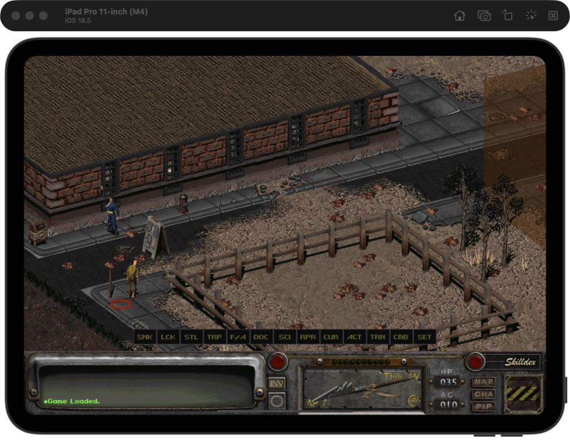
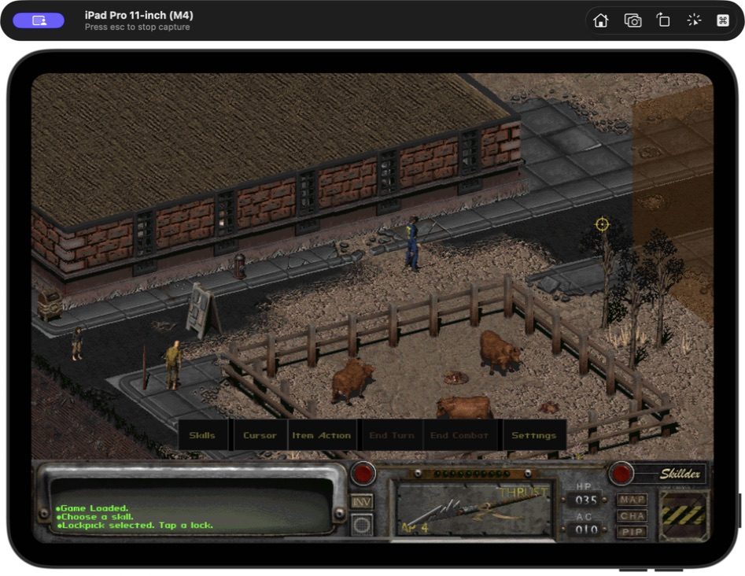
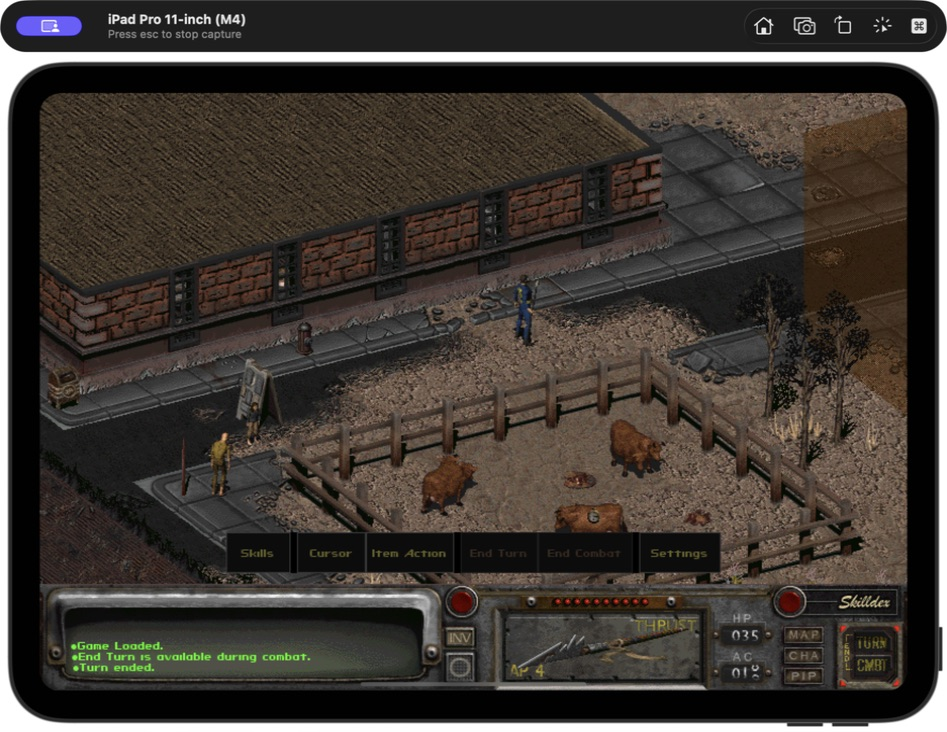
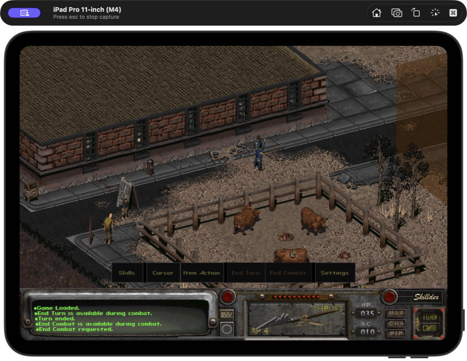
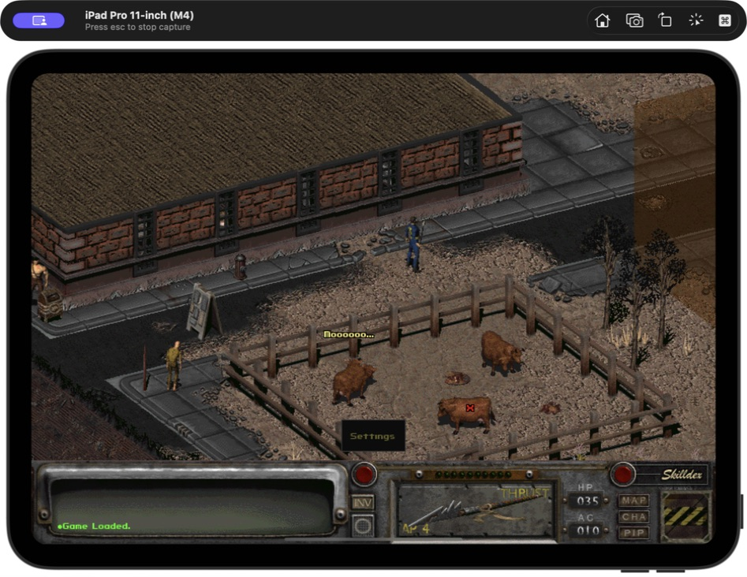

# iPad quick-toolbar usability audit

> Historical checkpoint. Direct user testing on iPadOS 26 found that this six-button revision still duplicated Fallout controls and allowed modal tap-through. It was superseded by the [2026-07-19 command-bar and Settings iteration](../../playtests/2026-07-19-toolbar-settings-iteration.md).

Date: 2026-07-18
Surface: VaultPad gameplay on the 11-inch iPad Pro (M4), iOS 18.5 Simulator
Goal: make every bottom action understandable and prove that it works without adding visual clutter.

## Verdict

The original strip failed basic clarity: thirteen identical buttons used unexplained abbreviations, did not group related actions, and silently ignored combat commands outside combat. The replacement passes the Simulator flow with six full-label controls, a named Skills panel, visible combat availability, and concise feedback in Fallout's existing message display.

## 1. Original toolbar — poor

`SNK`, `LCK`, `STL`, `TRP`, `F/A`, `CUR`, `ACT`, `TRN`, `CMB`, and `SET` required prior knowledge. All buttons had the same weight, their targets were only 24 engine pixels high, and invalid combat taps gave no response.

## 2. Full-label toolbar — healthy

The strip now exposes **Skills**, **Cursor**, **Item Action**, **End Turn**, **End Combat**, and **Settings**. Related controls are separated by small gaps, targets are 38 engine pixels high, and the original dark metal/yellow Fallout palette is preserved. End Turn and End Combat dim whenever they cannot be used.

## 3. Skills and targeting feedback — healthy

Skills opens Fallout's existing panel, where all eight names are already written in full. Sneak, Lockpick, Steal, Traps, First Aid, Doctor, Science, and Repair were each selected by touch. Each targeted skill now states what the player should tap next; Sneak confirms that it toggled.

## 4. Combat controls — healthy

End Turn was tested during the player's active turn. It posted **Turn ended**, advanced combat, and immediately dimmed both combat controls during the non-player turn. Outside combat, tapping it explains that it is only available during combat.

End Combat was tested during an active player turn and posted **End Combat requested**. During another actor's turn it remains dim and explains that the command is available on the player's turn.

## 5. Remaining controls — healthy

- Cursor cycled to Interact and posted **Cursor mode: Interact**.
- Item Action changed the equipped spear to its aimed action and posted **Item action: Aimed attack**.
- Settings opened the native VaultPad settings screen without moving the player or activating the world underneath.
- Turning the toolbar off retains the full-label Settings recovery tab.

## Accessibility notes

The tested iPad layout has substantially larger touch targets, visible labels, and redundant text feedback for state changes. Active and inactive combat states differ visually and remain tappable for an explanatory message. The game surface is still a bitmap UI, so Simulator screenshots cannot prove VoiceOver semantics, Dynamic Type behavior, switch control, or physical-device contrast and pointer behavior.
