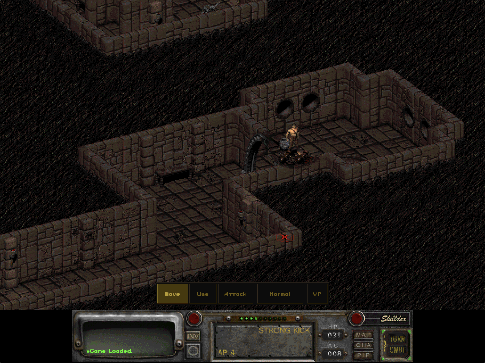

# Physical iPad display and combat audit — 2026-07-20

## Audit scope

Combined UX and accessibility review of the physical-iPad gameplay surface after enabling the revised touch command bar. The goal is to preserve Fallout's readable full-width HUD while making map movement, attack choice, action points, and turn completion understandable without hidden mouse conventions.

## Step 1 — Read the game and touch HUD together

**Health: Poor.** The command bar is clearer than the previous Settings slab, but the 910x682 internal display leaves Fallout's fixed 640-pixel HUD centered above large black gutters. The game world benefits from more visible area, but the most important combat information and original controls become materially smaller.

- Strength: Move, Use, and Attack are explicit and the active command is highlighted.
- UX risk: the display preset changes the relationship between the game world and HUD without explaining that trade-off before restart.
- Accessibility risk: the smaller belt reduces the effective size of Skills, inventory, character, Pip-Boy, Turn, and Combat targets.
- Recommendation: make the aspect-preserving 640x480 full-width HUD the default and label the wider canvas as an optional More Map trade-off.

## Step 2 — Pan the map

**Health: Poor based on the narrated physical test.** Two-finger drag is discoverable only through instructions and still feels like an indirect mouse shortcut. There is no persistent on-screen state confirming that a drag will move the map rather than the cursor or character.

- Recommendation: add an explicit Pan command beside Move, Use, and Attack. While selected, one-finger drag should pan and taps should not issue world commands. Keep two-finger drag only as an optional shortcut.

## Step 3 — Choose an attack and finish a turn

**Health: Poor.** `Normal` describes an implementation state, not the action the player will perform. The original HUD says `STRONG KICK`, but the touch bar hides that name and its AP cost. When the attack costs more AP than remains, repeated taps look broken. The original `TURN` target is both small and easy to overlook.

- Recommendation: show the real attack name and AP cost, explain that the crosshair percentage is the chance to hit, warn before entering Attack when AP is insufficient, and expose End Turn directly during combat.
- Accessibility risk: current state and failure recovery depend on reading small original-HUD text and understanding Fallout's undocumented turn rules.

## Highest-impact changes

1. Restore the full-width, non-distorted 640x480 Fallout presentation by default.
2. Add explicit one-finger Pan and remove the command bar's dependency on two-finger cursor cycling.
3. Replace `Normal` with the current move and AP cost, such as `Strong Kick 4 AP`.
4. Add a visible End Turn command during combat and direct insufficient-AP states to it.

## Implemented iteration

- The former 910x682 Comfort preset is migrated once to the aspect-preserving 640x480 `Full HUD` preset. `More Map` remains available as an explicit trade-off.
- `Pan` is a persistent command beside Move, Use, and Attack; while selected, a one-finger drag pans and a one-finger tap does not issue a world action.
- Two-finger drag remains an optional pan shortcut. Two-finger cursor cycling is suppressed while the explicit command bar is enabled.
- The item-action button now shows the actual move and cost, such as `Strong Kick 4 AP`, rather than `Normal`.
- Attack selection explains the crosshair percentage and refuses to arm an attack that costs more AP than remains, directing the player to End Turn.
- `End Turn` is restored to the touch bar during combat and explains that enemies act next.

## Verification

- Simulator and physical-device Debug builds: passed.
- Simulator runtime migration to 640x480: passed.
- Apple development signing, in-place iPad installation, and launch: passed.
- Physical iPad config reports `resolution_x=640`, `resolution_y=480`, `display_preset=classic`, and the command bar enabled.
- Existing `SAVEGAME/SLOT01` remains present after installation.
- Physical gesture comfort and combat comprehension remain the next acceptance gate.

## Evidence limits

The screenshot confirms the display hierarchy and target-size regression. Gesture comfort, map-pan cadence, attack targeting precision, and combat comprehension require a rebuilt physical-device pass.
