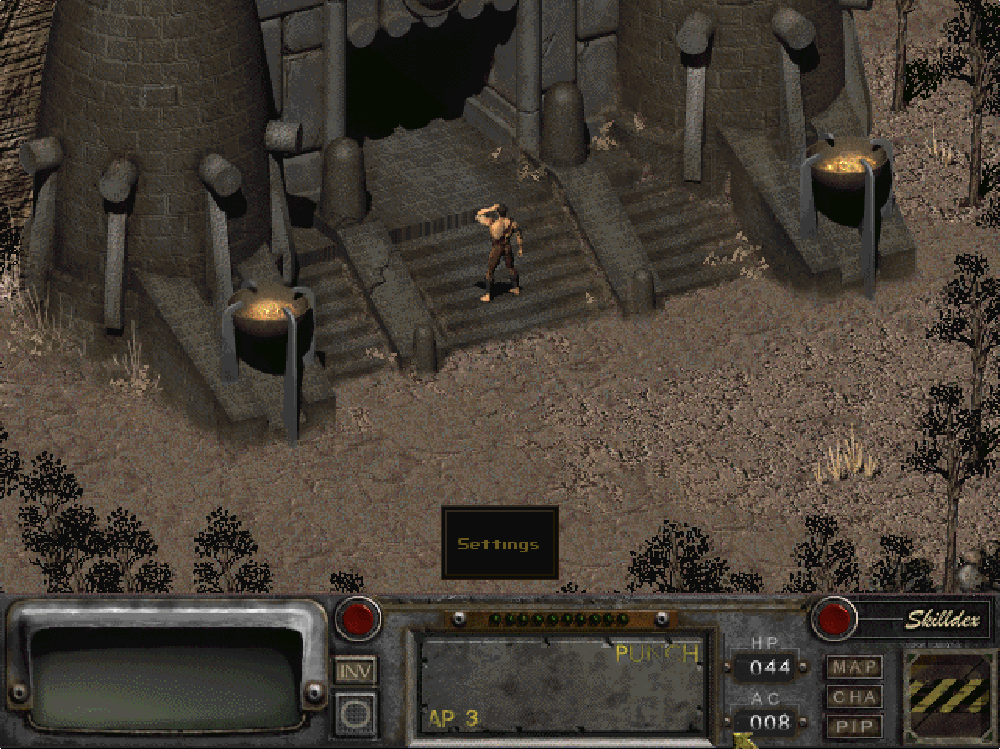
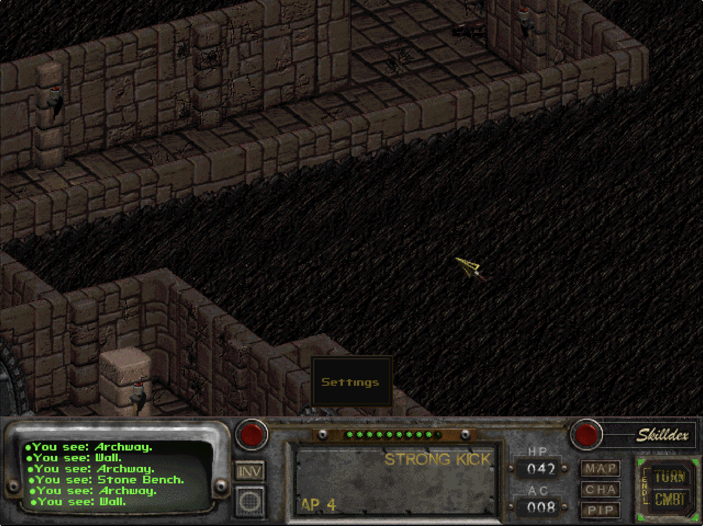

# Physical iPad touch-flow audit — 2026-07-20

## Audit scope

Combined UX and accessibility review of the physical-iPad flow from new-game movement through cursor switching, map panning, combat, and opening/closing VaultPad Settings.

User goal: move, inspect, interact, fight, pan the map, and return from settings without having to reason about hidden mouse state.

## Step 1 — Enter gameplay and find the active command

**Health: Poor.** The game is healthy and readable, but the centered Settings-only control looks like a persistent modal or stuck selection. It occupies valuable world space and gives no indication whether the current action is Move, Use, or Attack.

- Strength: the control is visually distinct and has a generous touch target.
- UX risk: “Settings” is the only visible VaultPad state even though it is not the player’s active gameplay command.
- Accessibility risk: low-contrast amber text and a floating position separate the control from both the game HUD and a predictable screen edge.
- Recommendation: use a compact, edge-anchored `VP` access tab when commands are collapsed; show explicit, highlighted actions when commands are enabled.

## Step 2 — Pan, inspect, and act during combat

**Health: Needs work.** The original HUD communicates AP and the selected attack, but VaultPad does not explain how its touch gesture state relates to that HUD. Two-finger panning emits discrete scroll steps too frequently on faster drags and not at all on small per-frame movements, making the camera feel alternately chunky and stuck.

- Strength: the original AP, attack, Turn, and Combat controls remain visible and should remain the single source for turn state.
- UX risk: two-finger tap cycles a legacy cursor without persistent confirmation when the command bar is collapsed.
- UX risk: low AP is interpreted as a broken attack because the touch layer does not direct the player to the original `TURN` control.
- Accessibility risk: interaction meaning depends on gesture memory and transient cursor art, with no durable text state.
- Recommendation: accumulate camera-pan travel before emitting measured scroll steps; keep Move/Use/Attack explicit; explain the original Turn control in the touch guide.

## Step 3 — Open Settings, apply changes, and return

**Health: Poor based on the physical-device behavior report; no settings screenshot was supplied for this step.** The native settings window becomes key, but the prior game window was not explicitly restored as key when settings closed. Control changes were written to disk but described as restart-only, so returning to gameplay gave weak or contradictory feedback.

- UX risk: Close and Save Changes behave like separate exits, while only one actually stores the selected controls.
- Accessibility risk: focus/key-window restoration and touch-state cleanup were not explicit, creating a plausible stuck-cursor/focus condition after dismissal.
- Recommendation: provide `Cancel` and one primary `Apply & Return` action, apply touch settings immediately, restore the game window explicitly, and clear stale touch state on return.

## Highest-impact changes

1. Replace the centered Settings slab with a compact lower-right `VP` tab in collapsed mode.
2. Apply touch mode, sensitivity, and command-bar visibility immediately on `Apply & Return`.
3. Restore the SDL game window as the key window and reset pending touch state after native settings closes.
4. Smooth two-finger panning with accumulated movement thresholds.
5. Expand the touch guide with concrete one-finger, two-finger, and low-AP combat instructions.

## Implemented iteration

- Collapsed mode is now a small lower-right `VP` tab instead of the centered Settings slab.
- Expanded mode keeps the original Fallout Skills/Turn/Combat controls authoritative and exposes only the touch commands that add value: cursor mode, item action, and VaultPad settings.
- Item actions use shorter labels (`Use Item`, `Normal`, `Aimed`, `Alternate`, `Aimed Alt`, `Reload`) so their state is easier to scan.
- Touch mode, sensitivity, and command-bar visibility now apply immediately through the running engine when `Apply & Return` succeeds.
- Closing native settings explicitly restores the game window and clears queued touch/gesture state.
- Two-finger camera movement now accumulates travel before emitting a measured pan step, avoiding the previous small-drag dead zone and fast-drag burst.
- Settings now explains Hybrid, Direct, and Trackpad; the original `TURN` button; the two-finger gestures; display restart behavior; and the save-only backup boundary.

## Verification

- Simulator Debug build: passed.
- Simulator install with local-only game data and launch through the Fallout intro: passed.
- Physical iPad Debug build and Apple development signing: passed.
- In-place install and launch on Chris' iPad Pro: passed.
- Existing `master.dat`, `critter.dat`, `patch000.dat`, configuration, and `data/SAVEGAME/SLOT01` remained present after installation.
- Physical touch comfort and precision remain an acceptance gate for the next hands-on pass.

## Evidence limits

The two screenshots prove the visible gameplay states but cannot prove gesture timing, focus restoration, haptics, or touch-target hit testing. Those require a rebuilt physical-device pass. The native settings screen was not captured in this audit, so its visual critique is limited to the current implementation and the user’s narrated behavior.
